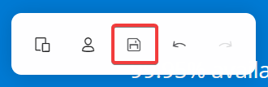

# ハンズオン: 「開発者ポータル」の作成

■開発者ポータルの設定

- 画面左メニューの「ポータルの概要」をクリック
- 画面上部の「開発者ポータル」をクリック

Webブラウザーで新しいタブが開く

ページが表示されるまで1分ほど待つ

「開発者ポータル」のデザイン画面が表示される。

ページ内の要素を編集できる。

編集後は保存する。

参考: https://www.google.com/search?q=%E3%83%95%E3%83%AD%E3%83%83%E3%83%94%E3%83%BC+%E4%BF%9D%E5%AD%98%E3%83%9C%E3%82%BF%E3%83%B3

「開発者ポータル」のデザイン画面のタブを閉じる。

Azure portalのページを、F5（再読み込み）でリロードする。「公開」ボタンが押せるようになる。

 
  - 「公開」をクリック
  - 「はい」をクリック

  - 「CORSを有効にする」をクリック

  - 「はい」をクリック

■製品の設定

Azure portal＞API Management＞（作成したリソース）

- 画面左メニューの「製品」をクリック

- Starterをクリック

- 画面左メニューの「設定」をクリック
- 「サブスクリプションを要求する」のチェックを外す
- 画面上部の「保存」をクリック

■開発者ポータルの利用

「製品」の「Starter」のページから、「API Management」のインスタンスのトップページへ戻る。

- 画面左メニューの「概要」(一番上)をクリック
- 「開発者ポータルのURL」をクリップボードにコピー

- Webブラウザーで、Ctrl + Shift + Nを押して、InPrivateウィンドウ（シークレットウィンドウ）を開く。
- コピーしたURL（開発者ポータル）にアクセスする

- Explore APIsをクリック

- tenki-v1をクリック

- Try itをクリック

- （画面下部にスクロールして）Sendをクリック

- 東京の天気予報の情報が表示される

