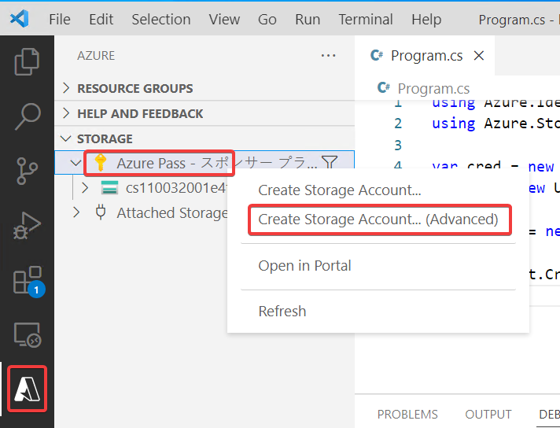
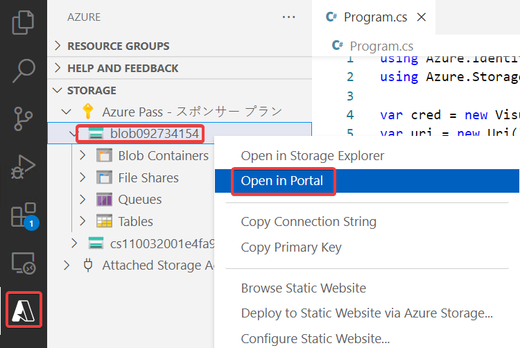
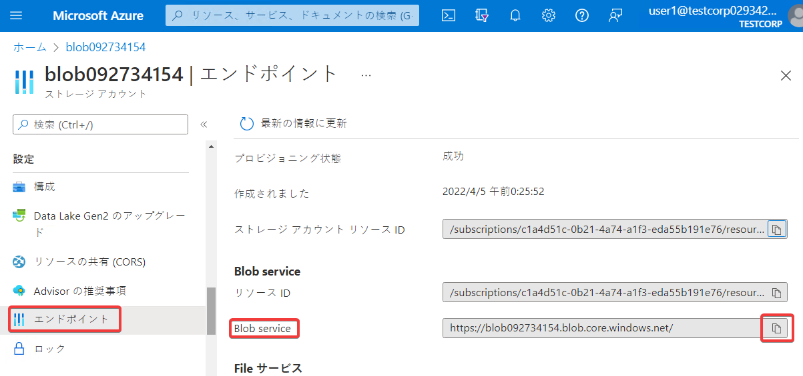

# ストレージアカウントの準備

- Enter a globally unique name
  - blob（乱数）
- Select a resource group...
  - ＋Create new resource group
- Enter the name of the new resource group
  - エンターキーを押す
- Would youlike to enable static website hosting?
  - No
- Select a location
  - East US

Blobの「エンドポイント」をコピーしておく。

