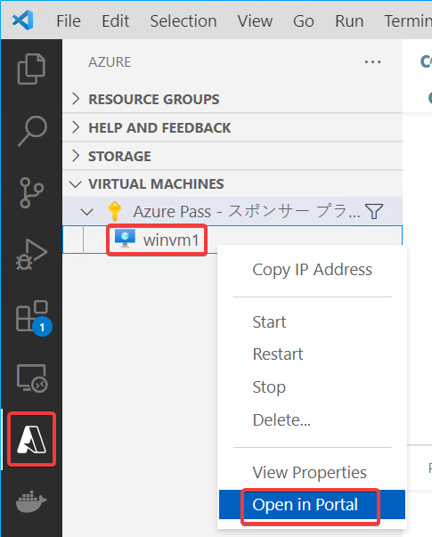
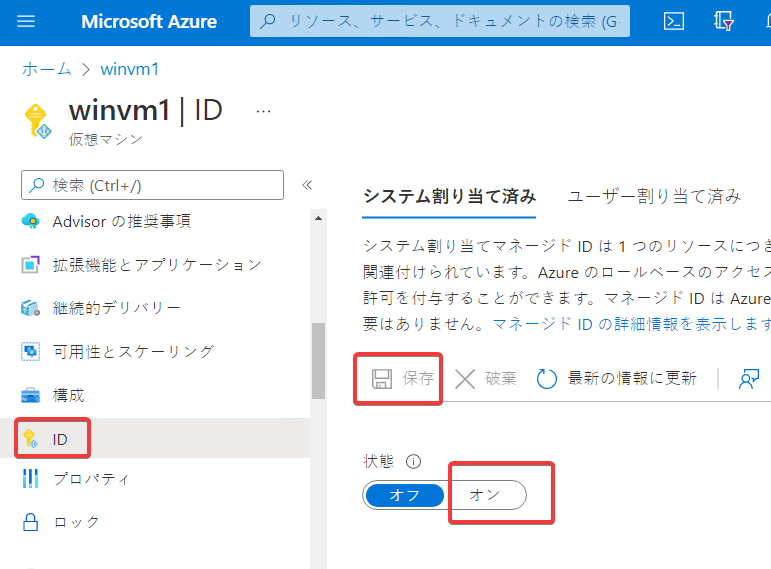
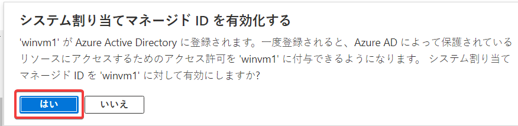
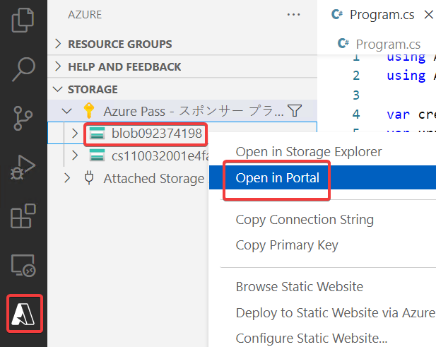
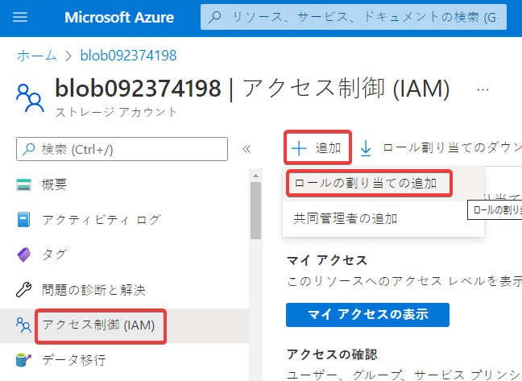
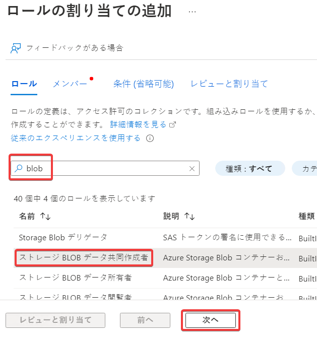
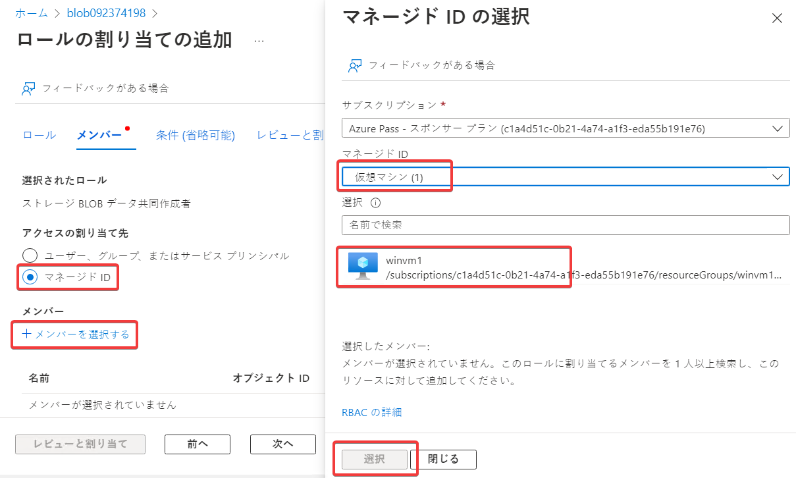
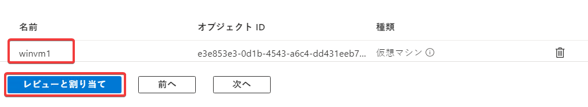
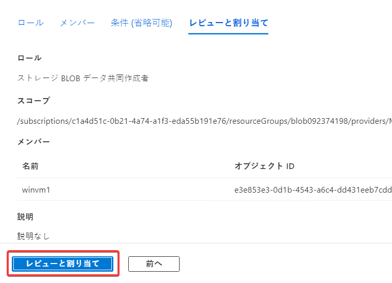
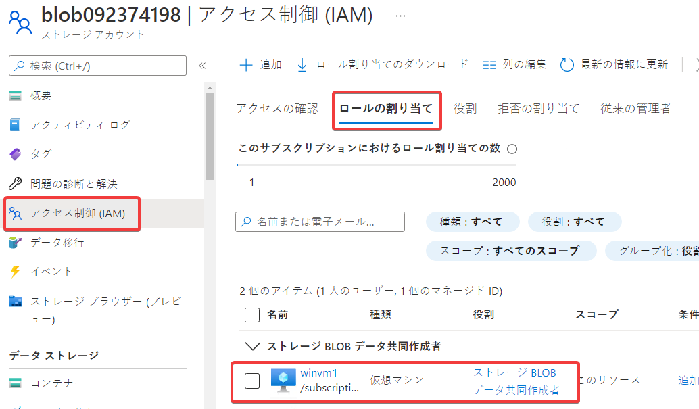

# ハンズオン: VMに、ストレージアカウントへのアクセス権を与える

VMのマネージドIDを有効化する。「オン」にして「保存」をクリック

操作対象のストレージアカウントをAzure portalで開く

アクセス制御（IAM）、追加、ロールの割り当ての追加

マネージドID、＋メンバーを選択する、仮想マシン、「選択」

以下のように「ストレージBLOBデータ共同作成者」ロールがVMに割り当てられていればOK

