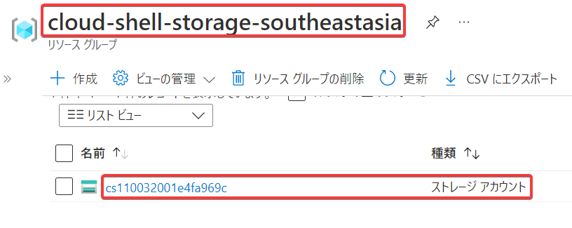

# ハンズオン: Cloud Shell

WebブラウザでAzure portalを開く
https://portal.azure.com/

画面上に並ぶアイコンの一番左「Cloud Shell」ボタンをクリック


以下のような画面が表示された場合は「ストレージの作成」をクリック


「Bash」（黒い背景）または「PowerShell」（青い背景）が起動する。

※「Bash」が起動した場合:


「Bash」・「PowerShell」の切り替えが必要な場合は、画面左上のプルダウンで行う。


※「PowerShell」に切り替えた場合:


さらに詳しい使い方については、Cloud Shell上部の「？」アイコンをクリックすると表示される。


## Cloud Shell用のリソースグループとストレージアカウント

Cloud Shellを使用すると、リソースグループ「cloud-shell-～～」とストレージアカウント「cs～～」が自動的に作成される。ストレージアカウント内にはファイル共有が作成される。



```
リソース グループ: cloud-shell-storage-<region>
└ Storage アカウント: cs<uniqueGuid>
    └ファイル共有: cs-<user>-<domain>-com-<uniqueGuid>
```

ファイル共有に対してごく少量のコスト（月0.36$ 程度）が発生する。

※少額であるため放置しても大きな問題はないが、気になる場合は、Cloud Shellを使用したあとで、リソースグループごと削除してもよい。

## 参考

[Azure Cloud Shellでフォント表示がおかしい場合の対処法](https://qiita.com/aical/items/f7a4c6cc0499936e7180)