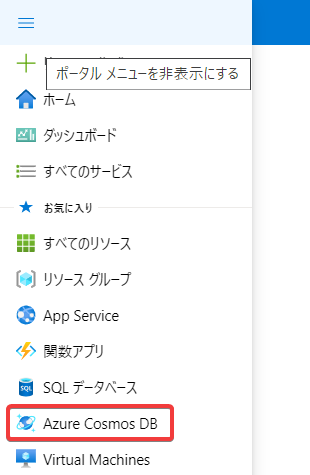
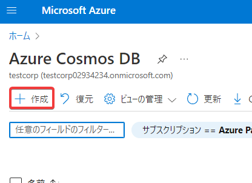
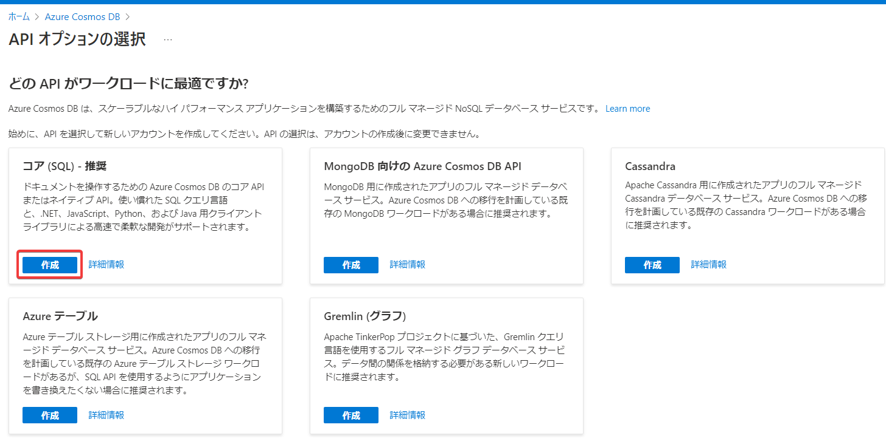
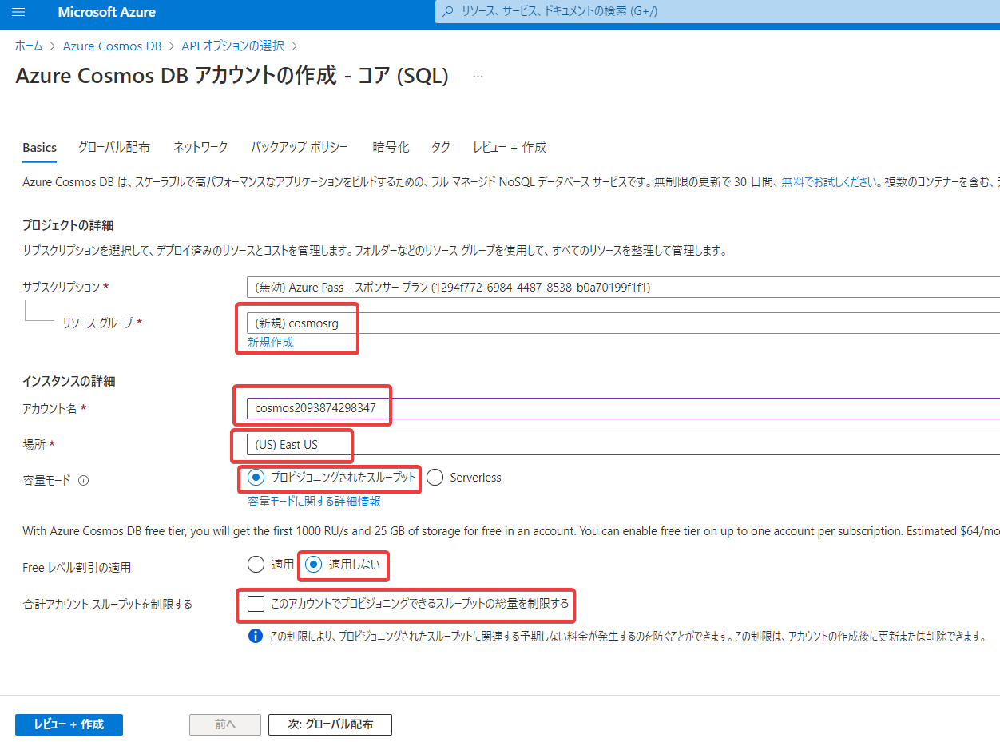

# Cosmos DBアカウントの作成（Azure portal）

- リソースグループ: 新規作成、適当な名前を指定
- アカウント名: 適当な名前を指定
- 場所: (US) East US
- 容量モード: プロビジョニングされたスループット
- Free レベル割引の適用: 適用しない
- 合計アカウント スループットを制限する: チェックを外す

「レビュー＋作成」、「作成」

