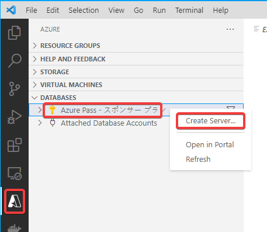

# ハンズオン: Cosmos DBアカウントの作成

- Select an Azure Database Server
  - Core (SQL)
- Account name
  - cosmos(乱数)
- Select a capacity model
  - Serverless
- Select a resource group...
  - + Create new resource group
- Enter the name of the new resource group.
  - エンターキーを押す
- Select a location for new resources
  - East US

