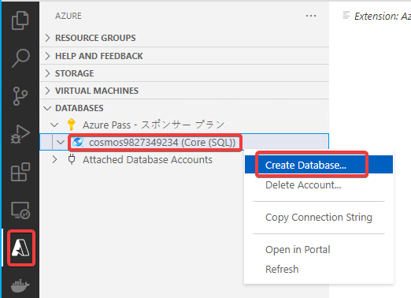
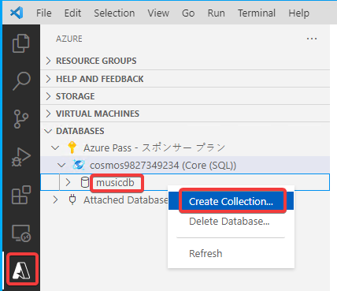
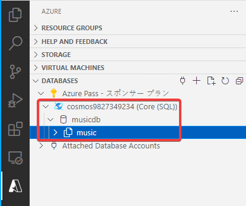

# ハンズオン: データベースとコレクションの作成


```
Cosmos DBアカウント
└ データベース
  └ コレクション
```



- Database Name
  - musicdb



- Enter an id for your Collection
  - music
- Enter the partition key for the collection
  - /artist

データベース「musicdb」とコレクション「music」が作成された。

