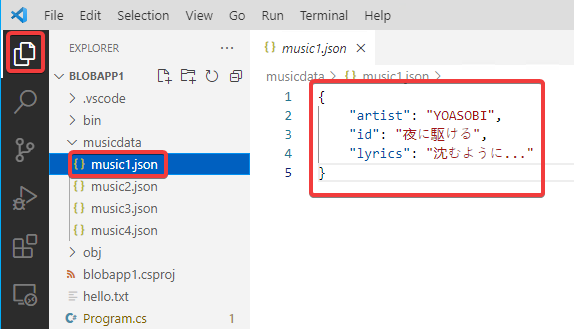
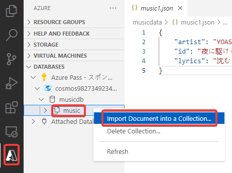
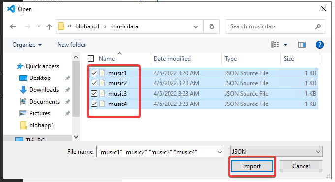
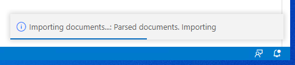
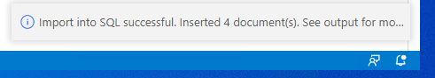
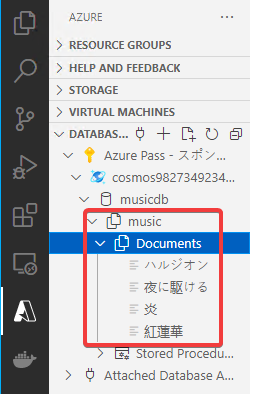

# ハンズオン: 項目の追加

あらかじめ、項目に対応するJSONファイルをいくつか作成しておく。

1項目 1JSON で作成。



JSONファイルの例

music1.json
```json
{
    "artist": "YOASOBI",
    "id": "夜に駆ける",
    "lyrics": "沈むように..."
}
```

music2.json
```json
{
    "artist": "YOASOBI",
    "id": "ハルジオン",
    "lyrics": "過ぎてゆく..."
}
```

music3.json
```json
{
    "artist": "LiSA",
    "id": "炎",
    "lyrics": "「さよなら」..."
}
```

music4.json
```json
{
    "artist": "LiSA",
    "id": "紅蓮華",
    "lyrics": "強くなれる..."
}
```



複数のJSONファイルをまとめて選択できる。







