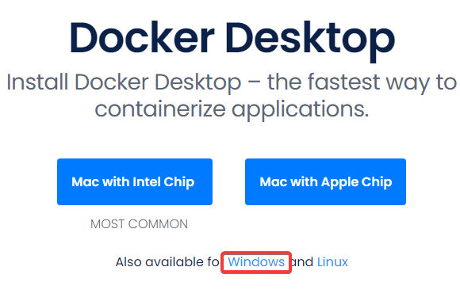
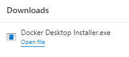
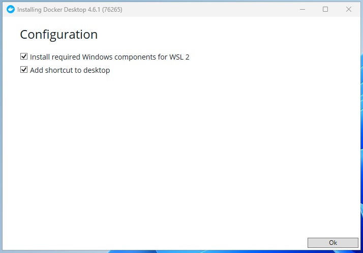
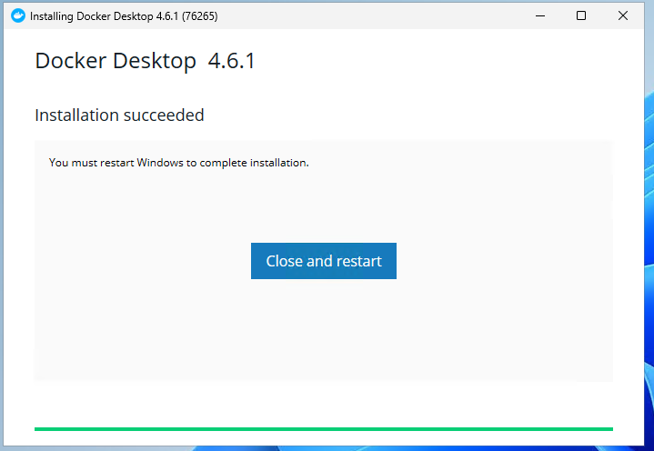
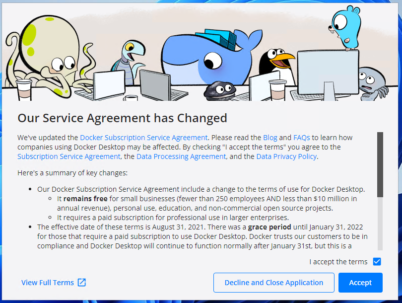
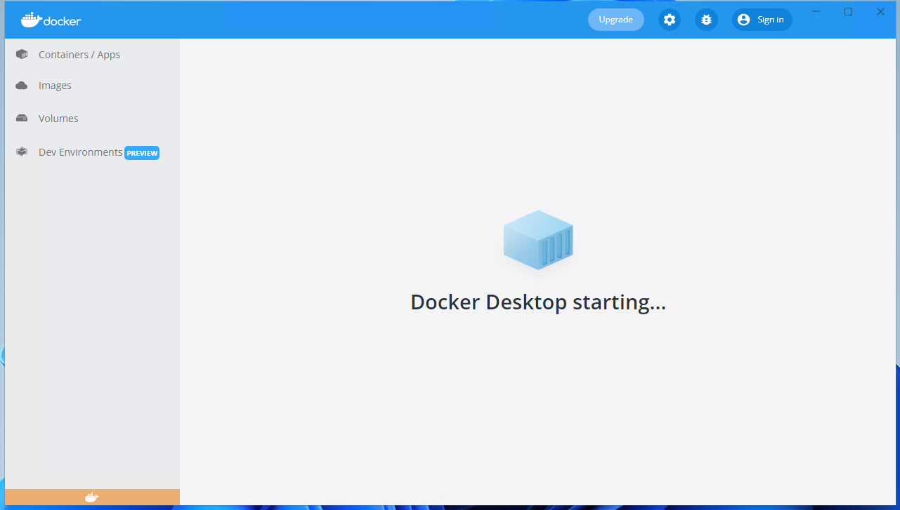
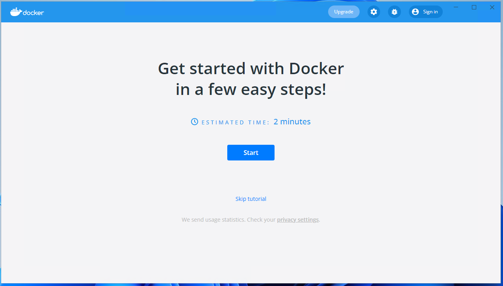
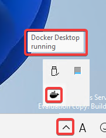

# ハンズオン: Docker Desktopのインストール

https://www.docker.com/products/docker-desktop/

Windows版をダウンロード

ダウンロードされたインストーラを開く

「OK」をクリック

Close and Restartをクリック

いったんリモートデスクトップ接続が切れるので、再度接続する

「I accept the terms」 にチェックを付け「Accept」。

Docker Desktopが開始される

「Start」をクリックしてチュートリアルを開始。画面に表示される内容に従って操作をしてDockerの基本を学ぶことができる。（またはSkip tutorialをクリックしてスキップ）

画面右下のインジケータ内のDockerアイコンが「Running」となっていればOK。

