Docker拡張機能をインストールする

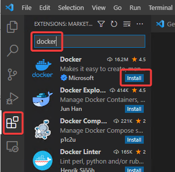

画面左のDocker拡張機能のアイコンをクリックすると、「Docker Desktop is not installed. Would you like to install it?」と聞いてくる。「Install」をクリック。

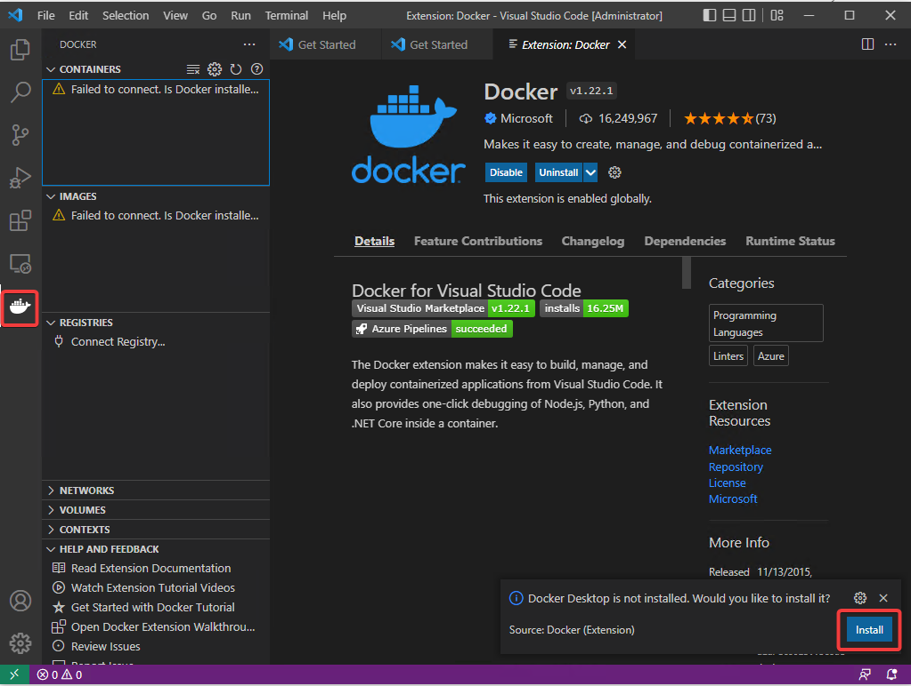

Dockerのインストールがスタートする

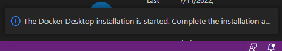

Dockerインストーラーが起動する。「OK」をクリック

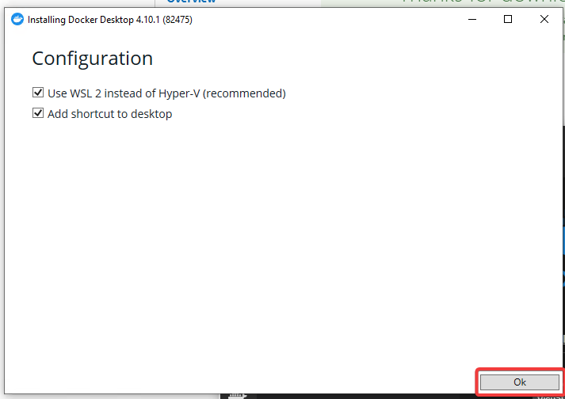

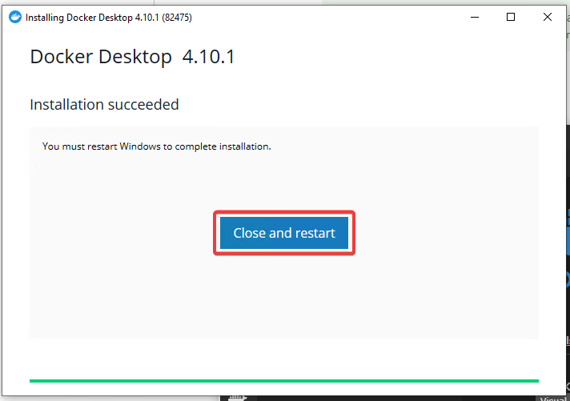

いったんリモートデスクトップが切断される。

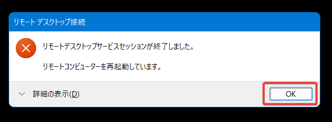


1分ほど待って、リモートデスクトップで再度接続する。

Service Agreementが表示される。

I accept the termsにチェックしてAcceptをクリック

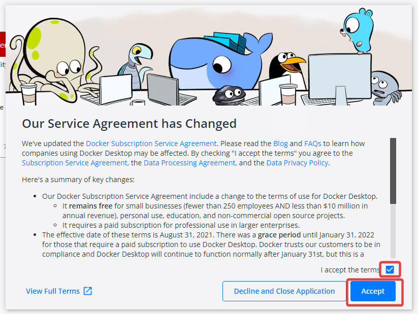

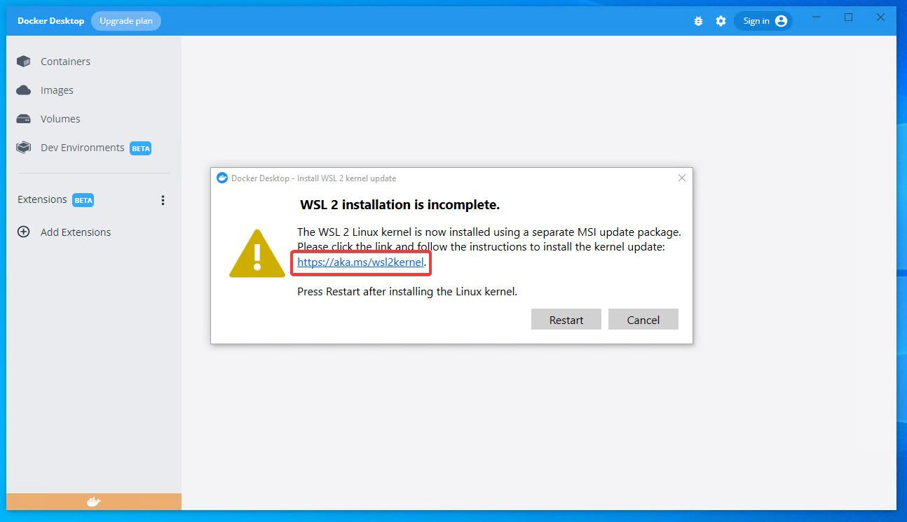

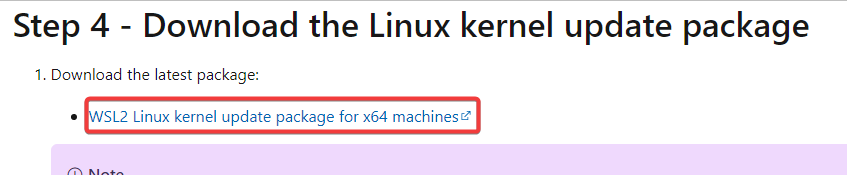

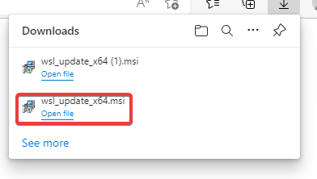

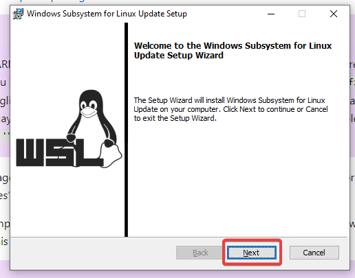

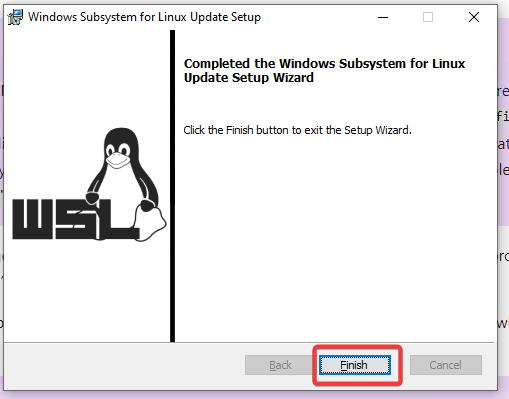

PowerShellを起動する

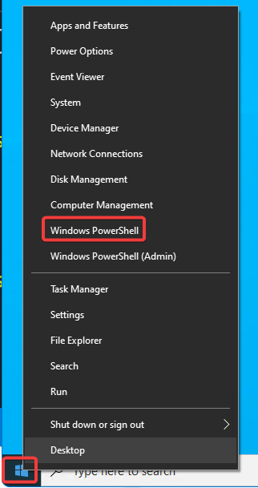

以下のコマンドを実行する

```ps
wsl --set-default-version 2
```

The operation completed successfully. と表示される

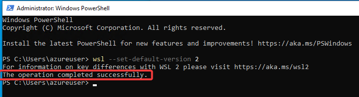


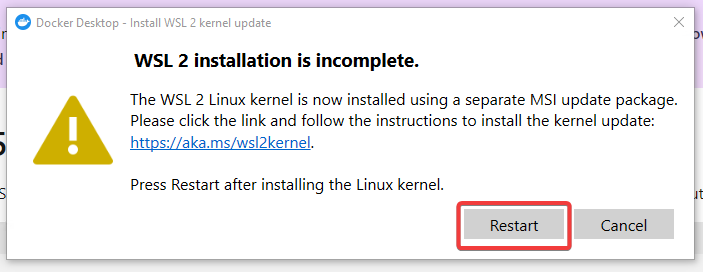
