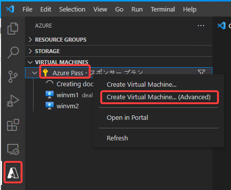

# Docker実行用のVMの作成

基本的に、現在のWindows Server上ではDockerが実行できない。

そこで、別途Linux VMを起動し、そこでDockerを動かす。

- Enter a name for the new virtual machine
  - dockervm1
- Select an OS
  - Linux
- Select an image
  - Ubuntu Server 20.04 LTS
- Enter a username
  - azureuser
- Enter a passphrase for connecting to this virtual machine
  - 何も入れずにエンターキーを押す
- Select a location for new resources
  - Japan East

仮想マシンが作成されるまでしばらく待つ。
