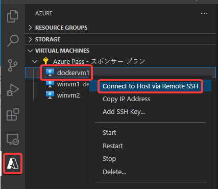
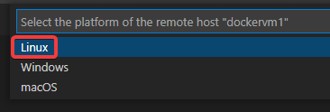
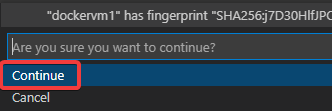
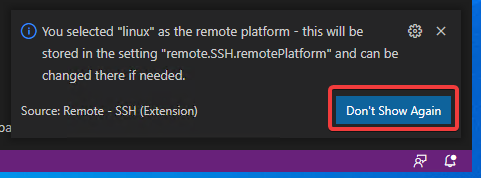
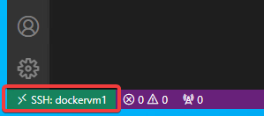
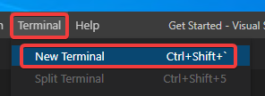
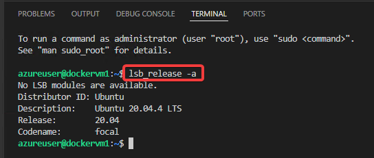

# Linux VMへの接続

新しいVisual Studio Codeのウィンドウが開く。

画面左下の「SSH: (VM名)」という表示で、このVisual Studio CodeウィンドウでSSH接続している、ということがわかる。

ターミナルを起動すると、SSH接続した先のLinux上に接続される

`lsb_release -a` で、Linuxのバージョン等を確認できる。

