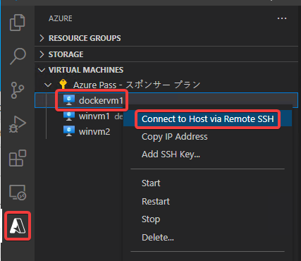

# Linux VMでのDockerの実行

ターミナルを開き、`docker run hello-world`と打ち込む。

`Hello from Docker!` と表示されればOK。

# `docker run hello-world` がエラーになってしまう場合

設定を反映させるため、いったん現在の（Linux VMにSSH接続している）Visual Studio Codeウィンドウを閉じる。

そしてLinux VMの再起動を行う。

1分ほど待って、「Restarting...」の表示が消えたら、再度「Connect to Host via Remote SSH」で接続する。

新しいVisual Studio Codeのウィンドウが開く。

ターミナルを起動し、`docker run hello-world`と打ち込む。

`Hello from Docker!` と表示されればOK。

