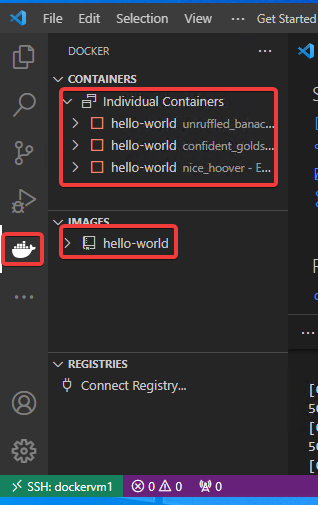

# Linux VMでの Docker拡張機能 のインストール

Dockerの操作をすばやく実行するための拡張機能をインストールする。

インストールが完了したら、画面左側のDockerアイコン（クジラ）をクリック。

実行されたコンテナーや、Docker HubからプルされたDockerイメージが確認できる。

※コンテナーやイメージの一覧が表示されず、エラーが表示される場合は、いったん、Visual Studio Codeウィンドウ（画面左下が SSH: dockervm1と表示されている）を閉じ、

dockervm1の再起動を行う。

再起動が完了したら再度 Connect to Host via Remote SSH で接続。

すると、Docker拡張機能が動作する。

