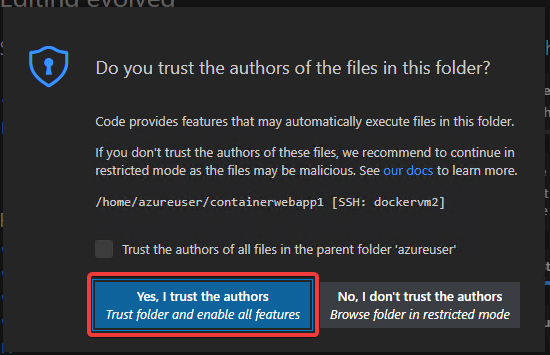
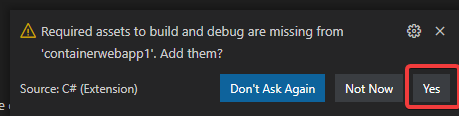
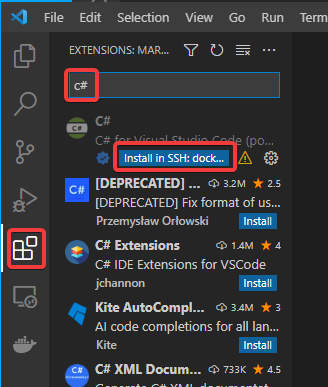
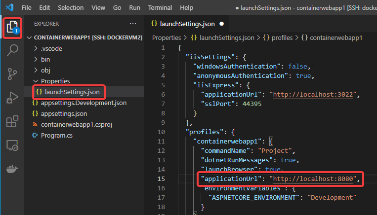
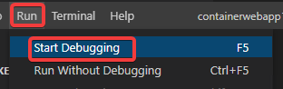
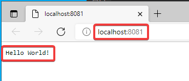
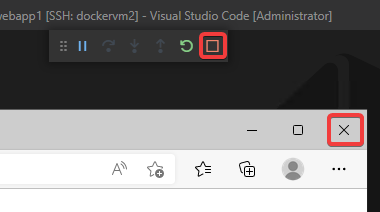

# Linux VM上で Webアプリを作成する

```
dotnet new web -n containerwebapp1
code -r containerwebapp1
```

Visual Studio Codeウィンドウがリロードされる。

下記のようなダイアログが出た場合は「Yes」をクリック。




下記のようなダイアログが出た場合は「Yes」をクリック。



拡張機能のアイコンをクリックし、「C#」と検索。C#拡張機能がインストールされていない場合はインストール。



画面左のエクスプローラ（ファイル一覧）のアイコンをクリック。

Properties フォルダ内の launchSettings.json を開く。

ファイル中央付近、`applicationUrl` の 右側の文字列を `http://localhost:8080` に修正する。

※もともとここには2つのアドレスが書かれている。いったん全部消して、上記を記入する。

※「https」ではなく「http」とする。



`Ctrl + s`で、ファイルを保存する。

Run 、Start Debugging で、プロジェクトのデバッグを開始する。



Webブラウザが起動し、「Hello World!」と表示される。

※このとき、さきほど `launchSettings.json` で設定したポート番号以外の番号が使用されることがあるが、それは問題ない。



Webブラウザを閉じ、デバッグを終了する。



