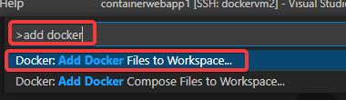
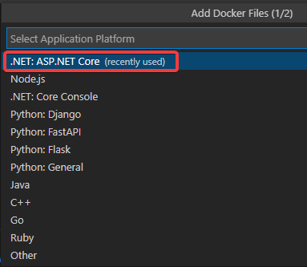
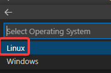
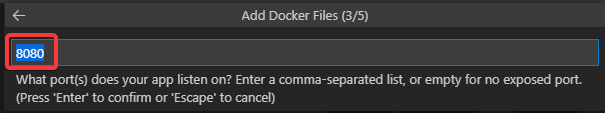
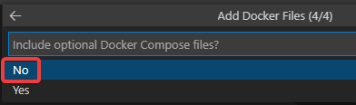
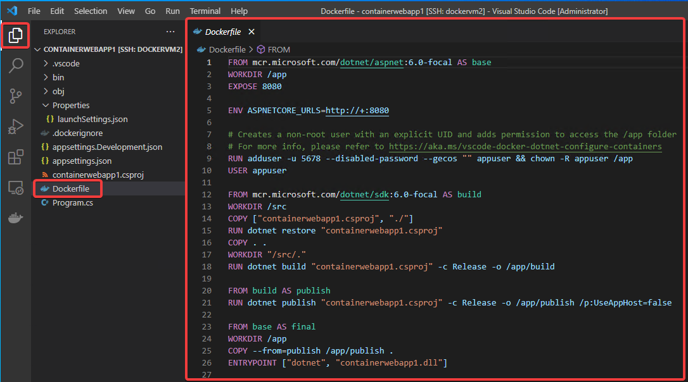

# .NET Webアプリ用のDockerfileを作る

F1を押してコマンドパレットを起動し、`add docker`で検索。`Docker: Add Docker Files to Workspace...` を選択。

`.NET: ASP.NET Core`を選択

`Linux`を選択。

`8080` を入力。

`Docker Compose`ファイルを作るかどうかの質問。Noをクリック

自動的にDockerfileが作られる。

