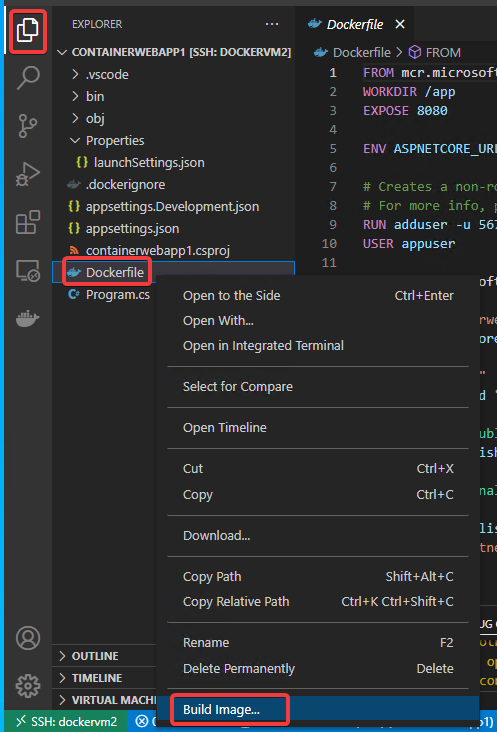
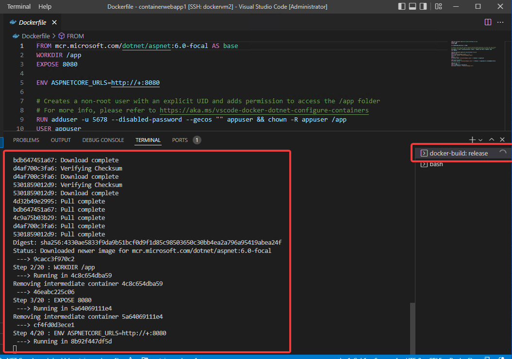
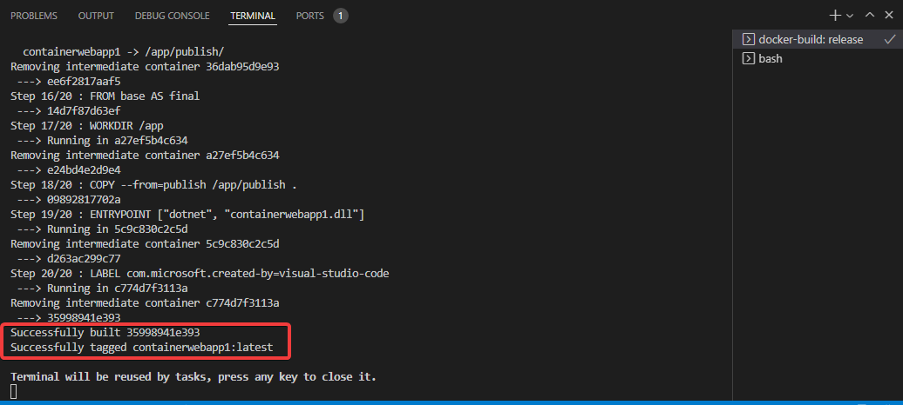
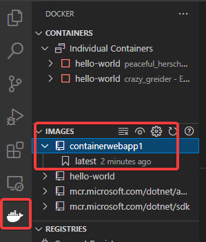

# Dockerイメージのビルド

Dockerfileにもとづき、イメージのビルドが行われる。しばらく待つ。

最終的に「Successfully built」「Successfully tagged containerwebapp1:latest」 といったように表示されればOK.

Docker拡張機能をクリックし、IMAGES内に、containerwebapp1、latestが存在することを確認。

