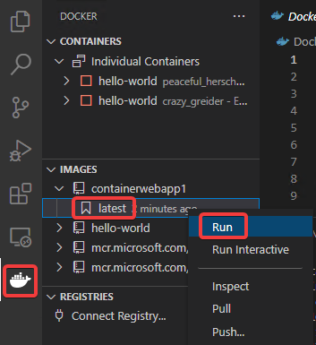
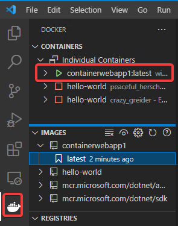
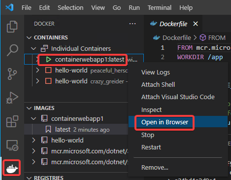
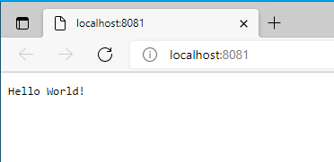
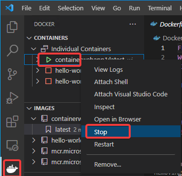

# コンテナー化されたWebアプリを実行

IMAGES内の、containerwebapp1、latest を右クリックして「Run」

CONTAINERS内に、containerwebapp1:latest が起動してくる。

起動したコンテナーを右クリックして、「Open in Browser」

Webブラウザーが起動し、Hello World!が表示される。

Webブラウザーを閉じ、起動したコンテナを「Stop」で停止させる。

