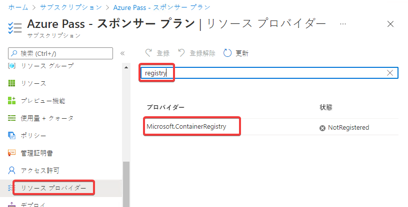
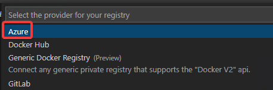

# Azure Container Registry レジストリの作成

Webブラウザーで https://portal.azure.com/ (Azure portal) にアクセスし、サブスクリプションを表示。

使用中のサブスクリプションをクリック。

registry で検索

検索結果の Microsoft.ContainerRegistry をクリックし、「登録」

何度か「更新」をクリックし、「Registering」が「Registered」となればOK。

Visual Studio Code（画面左下が緑色のSSH: dockervmとなっているウィンドウ）に戻る。

「Install Azure Account Extension...」の表示が消え、代わりに Azureサブスクリプション名が表示される。

※もし「Sign in to Azure...」と表示された場合は、クリックして、サインインする。

- Provide a registry name
  - acr(乱数)
- Select a SKU
  - Basic
- Select a resource group
  - + Create new resource group
- Enter the name of the new resource group
  - エンターキーを押してデフォルト値を受け入れる
- Select a location for new resources
  - East US

ACRレジストリが作成される。

