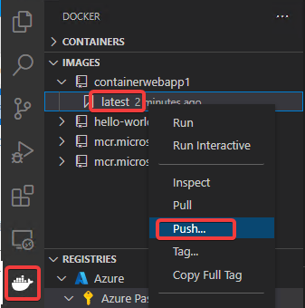
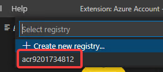
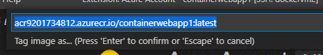
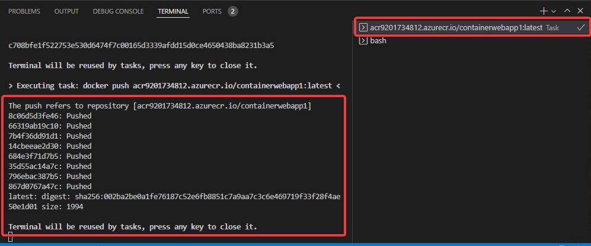
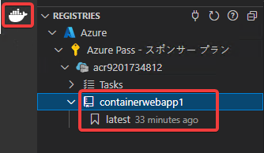

# Azure Container Registry レジストリへのイメージのプッシュ

Docker拡張機能をクリックし、IMAGES内の、containerwebapp1のlatestを右クリックし、Push...を選択

さきほど作成したAzure Container Registryを選択

エンターキーを押して、デフォルトのタグを受け入れる

タスクが実行され、イメージがプッシュされる。

REGISTRIESで、さきほど作成したAzure Container Registry内に、プッシュしたイメージが格納されていることが確認できる。

