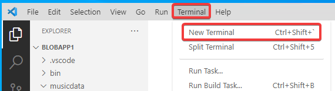
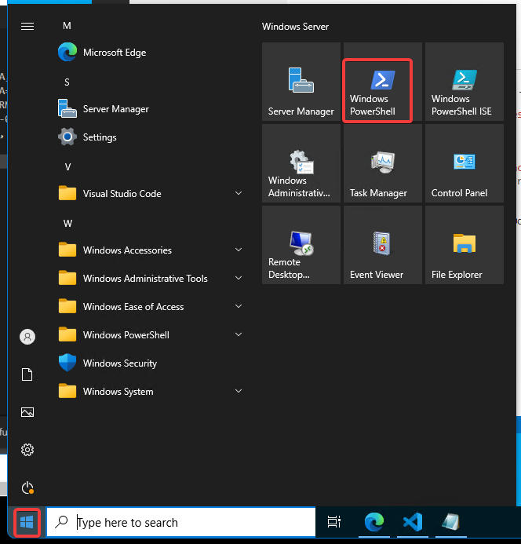
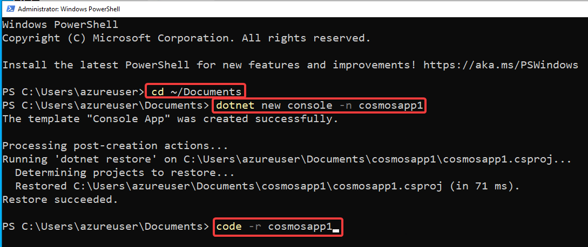
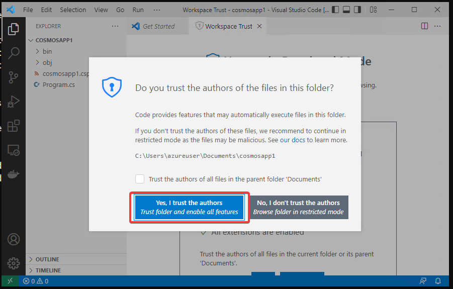
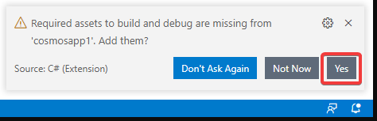
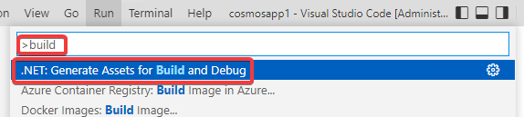
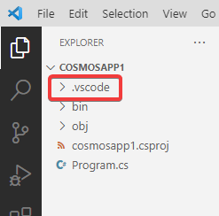

# ハンズオン: 新しいプロジェクトの作成

Visual Studio Codeで、Terminal を開く。



または、Windows PowerShellを開く。



以下のコマンドを投入する。`プロジェクト名`の部分は、適当な名前を指定する。

プロジェクト名の例:

- blobapp1
- cosmosapp1
- webapp1

```
cd ~/Documents
dotnet new console -n プロジェクト名
code -r プロジェクト名
```



Visual Studio Codeが開く。「Do you trust the authors of the files in this folder?」というダイアログが表示される。「Yes」をクリック。



`Required assets to build and debug are missing ... Add them?` と聞いてくる。「Yes」をクリックする。プロジェクトに「.vscode」フォルダが追加される。



上記ダイアログは1分ほどで勝手に閉じられてしまう。その場合は F1 を押してコマンドパレットを出し、`build` で検索し、「.NET: Generate Assets for Build and Debug」を選択すると、ダイアログで「Yes」をクリックした場合と同様、プロジェクトに「.vscode」フォルダが追加される。



※.vscode が追加された状態

