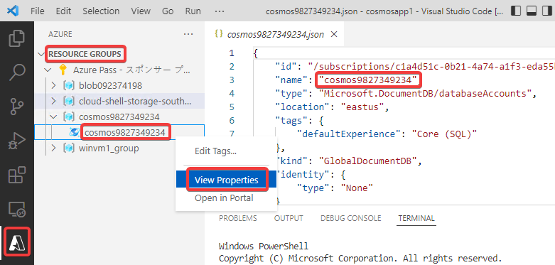
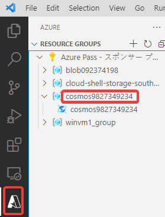
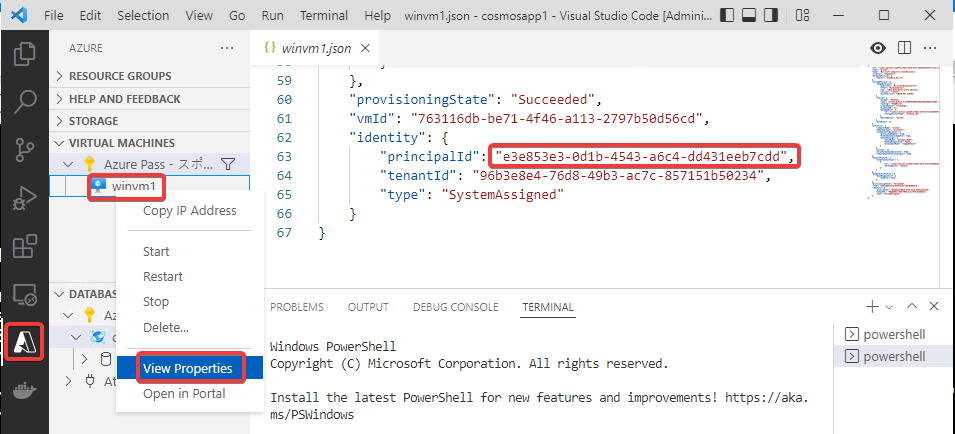
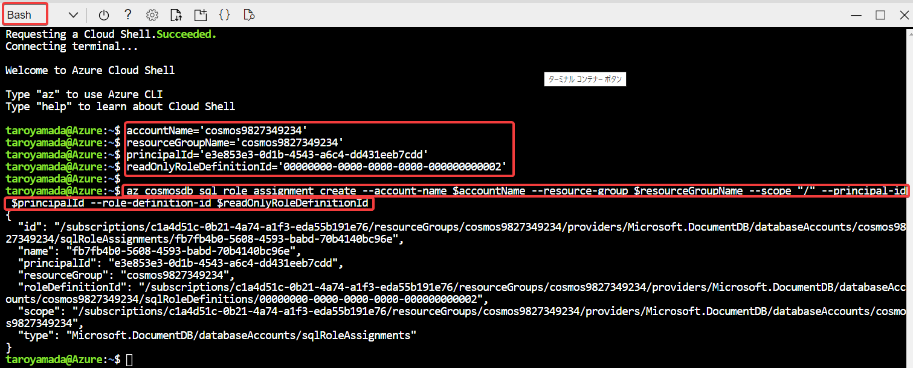

# Cosmos DBアカウントにて、VMに、必要なロールを割り当てる


(1)「Cosmos DB アカウント名」を調べる。



(2)「Cosmos DB アカウントを含むリソースグループの名前」 を調べる。



(3) VMの「マネージドID」の「プリンシパルID」を調べる


以下のコマンドをいったんコピーし、(1)(2)(3)部分を上記で調べた値に書き換える。

```
# (1) 「Cosmos DB アカウント名」
accountName='cosmos9827349234'

# (2) 「Cosmos DB アカウントを含むリソースグループの名前」
resourceGroupName='cosmos9827349234'

# (3) VMの「マネージドID」の「プリンシパルID」
principalId='e3e853e3-0d1b-4543-a6c4-dd431eeb7cdd'

# ロールの定義ID
roleDefinitionId='00000000-0000-0000-0000-000000000002'

az cosmosdb sql role assignment create --account-name $accountName --resource-group $resourceGroupName --scope "/" --principal-id $principalId --role-definition-id $roleDefinitionId
```

Cloud ShellでBashを起動し、上記コマンドを投入する。

実行例




■参考

https://docs.microsoft.com/en-us/azure/cosmos-db/how-to-setup-rbac#built-in-role-definitions

https://docs.microsoft.com/en-us/azure/cosmos-db/how-to-setup-rbac#using-the-azure-cli-1