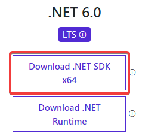
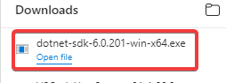
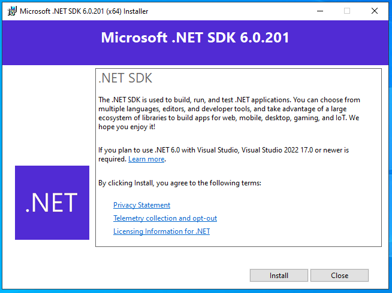
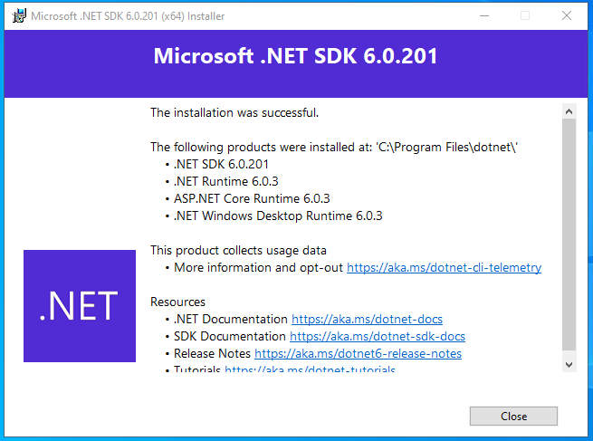
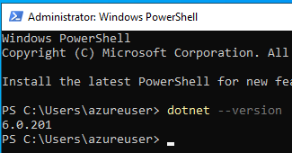

# ハンズオン: .NET SDK 6.0のインストール

Webブラウザで以下のサイトを開く。

https://dotnet.microsoft.com/en-us/download

「.NET 6.0」の「Download .NET SDK」をクリックする。

ダウンロードされたインストーラを開く。※ダウンロードされたインストーラをクリックしてから、インストーラの画面が出るまで、15秒ほどかかるので、クリックしたらしばらく待つこと。

「Install」をクリック。

しばらく待つ。※途中で「Cancel」をクリックしないこと。

「Close」が表示されたら、クリック。

画面左下のWindowsアイコンをクリックし、「powershell」と検索し、「Windows PowerShell」を起動する

`dotnet --version` を入力する。`6.0.400` といった、インストールした.NETのバージョン情報が出ればOK（バージョン番号は変わる場合がある）。PowerShellを閉じる。

※バージョン情報が出ない場合は、いったん **すべての** PowerShellウィンドウを閉じてから、再度PowerShellウィンドウを開き、`dotnet --version` を入力する。

※それでもだめな場合は、インストールがうまく完了していないので、ダウンロードとインストーラ実行をやり直す。

