# ハンズオン: Microsoft Edge の起動と初期設定

画面左下のスタートボタンをクリックし、Microsoft Edgeを起動する

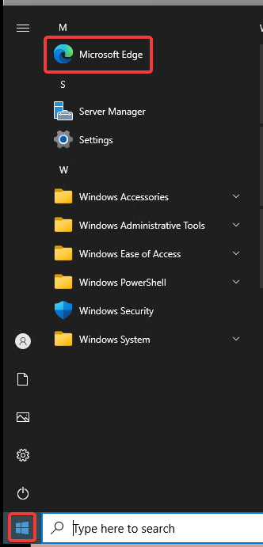

<!--
しばらく待つ

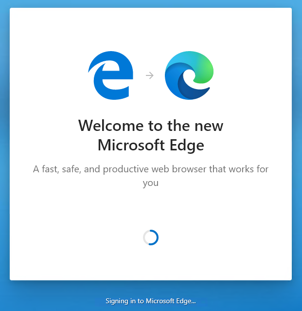

Get Startedをクリック

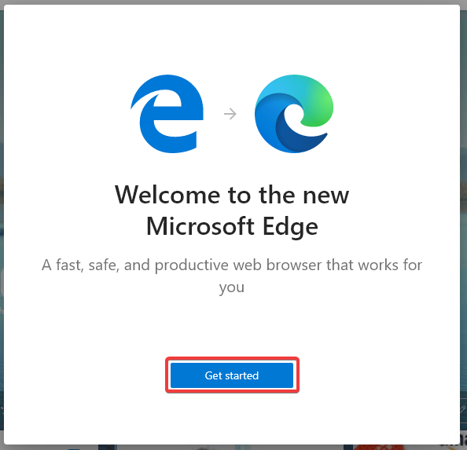

Focusedをクリック

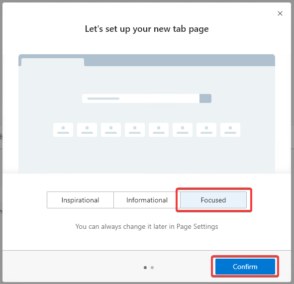

Continue without signing inをクリック

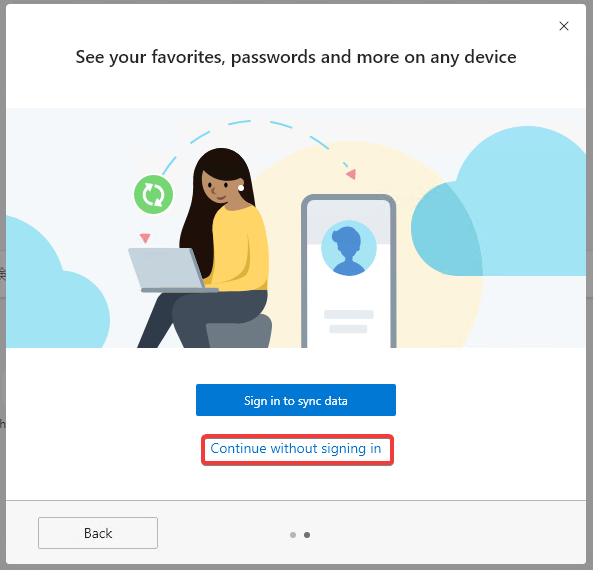

Microsoft Edgeの使い方が表示される。ここでいったん、Edgeのウィンドウを閉じる。

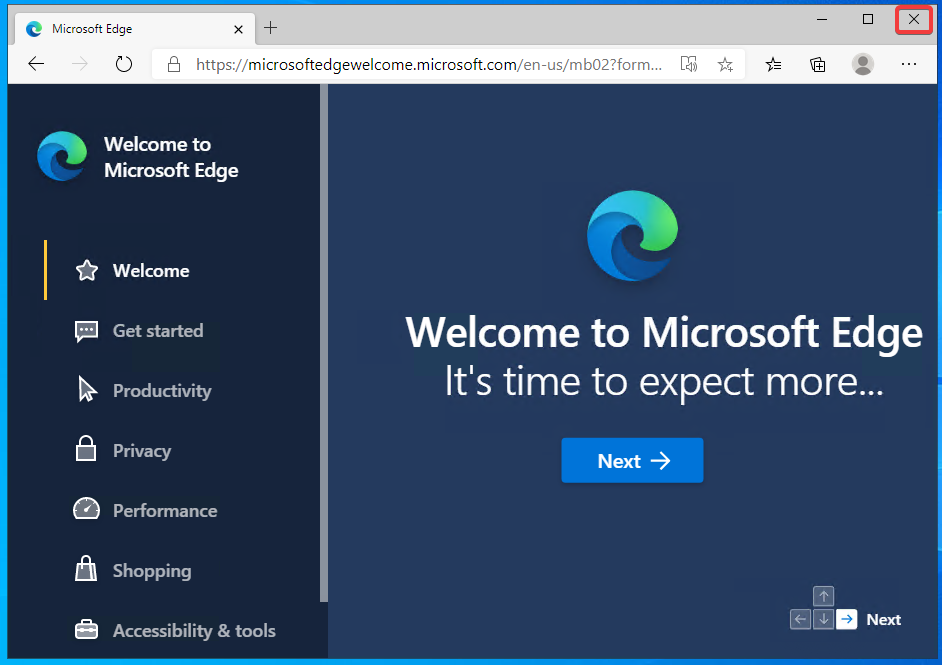

-->

「Start without your data」をクリック
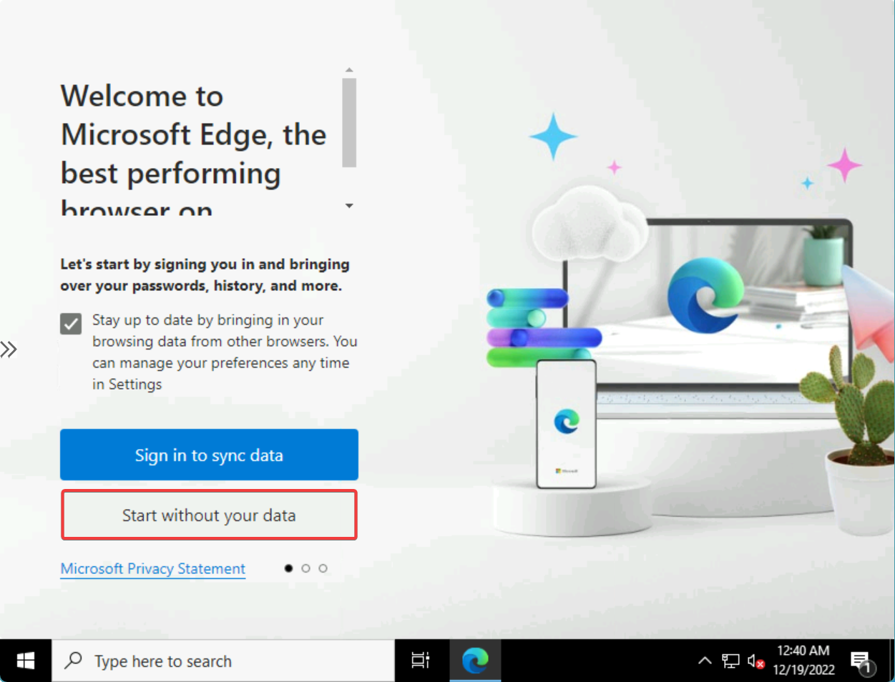

「Continue without this data」をクリック
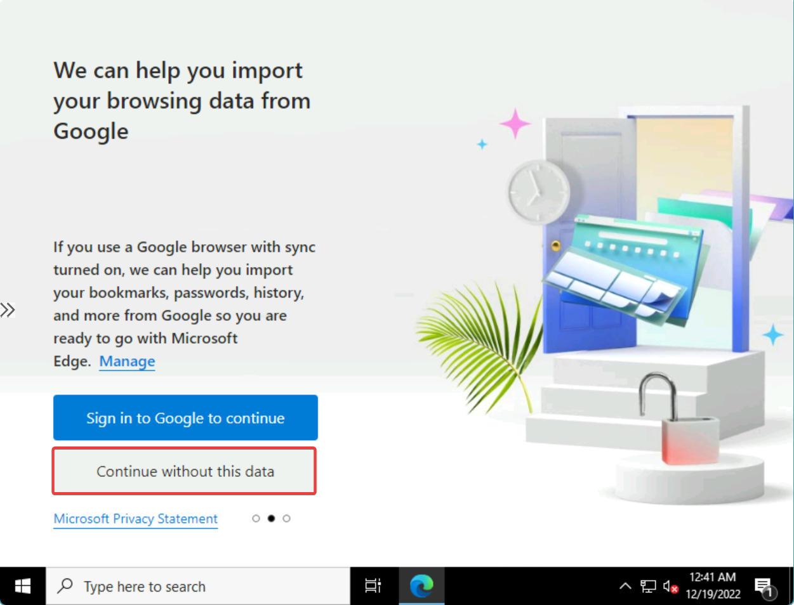

「Confirm and start browsing」をクリック
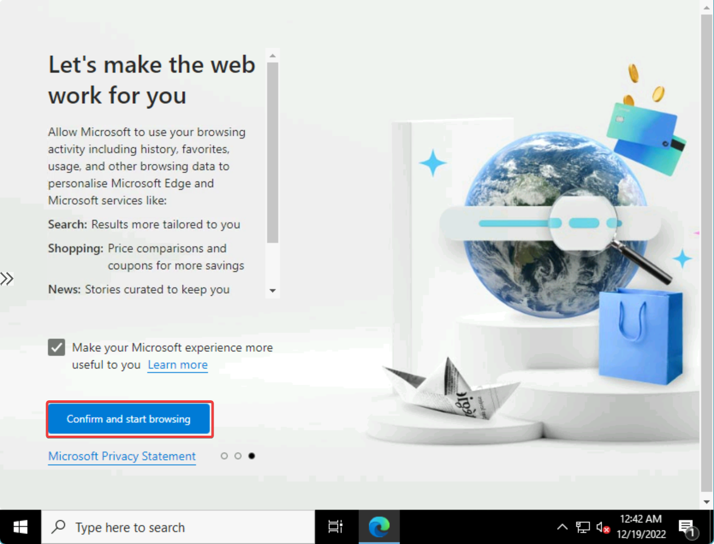

カスタマイズの案内が表示される。いったんタブをすべて閉じる。
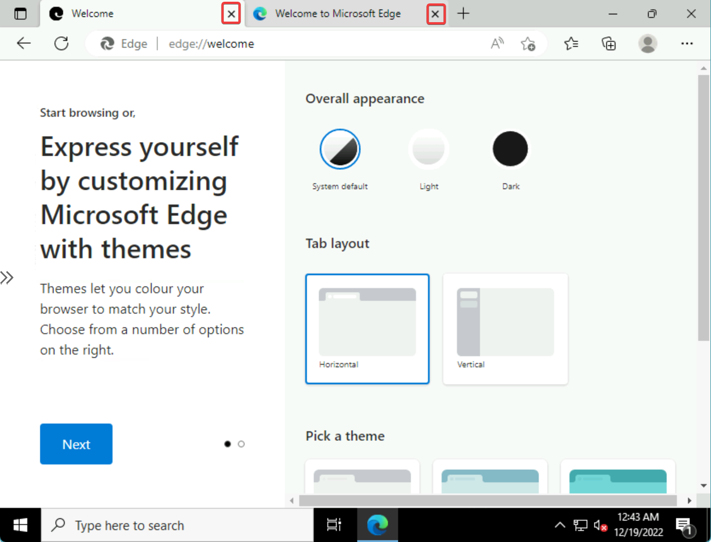

再度、画面左下のスタートボタンをクリックし、Microsoft Edgeを起動する

以上で、初期設定が終わり、Microsoft Edgeを使用してWebを閲覧できる状態になった。
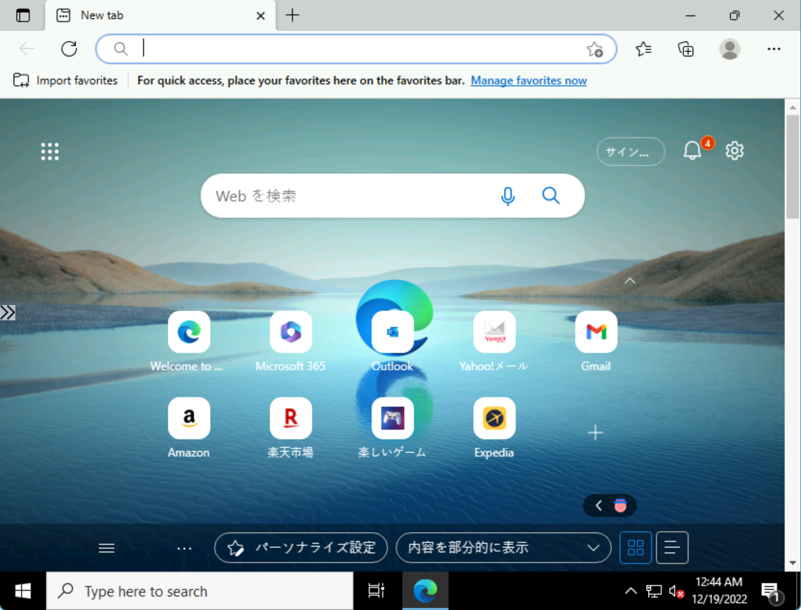
