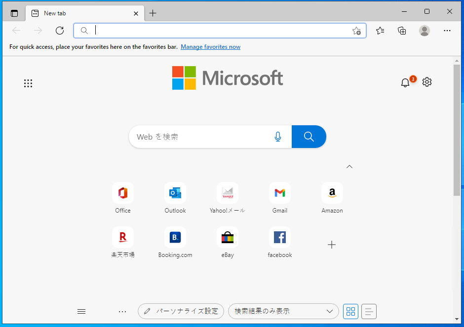

# ハンズオン: Microsoft Edge の起動と初期設定

画面左下のスタートボタンをクリックし、Microsoft Edgeを起動する

しばらく待つ

Get Startedをクリック

Focusedをクリック

Continue without signing inをクリック

Microsoft Edgeの使い方が表示される。ここでいったん、Edgeのウィンドウを閉じる。

再度、画面左下のスタートボタンをクリックし、Microsoft Edgeを起動する

以上で、初期設定が終わり、Microsoft Edgeを使用してWebを閲覧できる状態になった。

