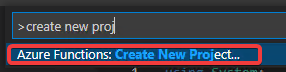
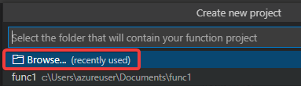
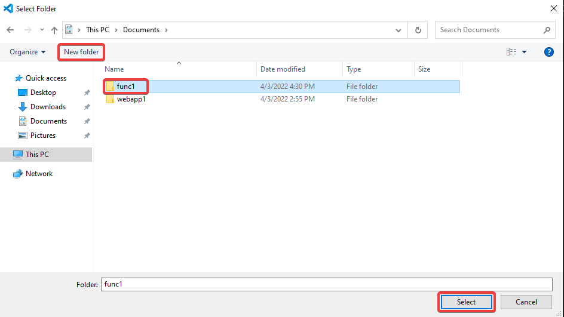
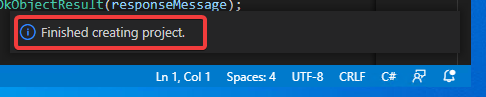
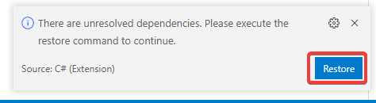

# Azure Functions 「関数アプリ」の作成

Visual Studio Codeの機能を使用して、ローカルで、「関数アプリ」のプロジェクトを作ります。また、プロジェクト内に、HTTPトリガーを使用する「関数」を作ります。

Visual Studio Codeを起動します。「F1」を押し、続いて「Azure Functions: Create New Project...」を入力します。

- Select the folder...
  - Browse...

「Documents」以下に「func1」フォルダを新規作成し、それをクリックして選択した状態で「Select」

- Select a language
  - C#
- Select a .NET runtime
  - .NET 6 LTS ※ 「.NET 6.0 Isolated LTS」ではなく「.NET 6.0 LTS」を選択
- Select a template for your project's first function
  - HTTP trigger
- Privide a function name
  - HttpTrigger1
- Provide a namespace
  - Company.Function
- AccessRights
  - Function
- Select how you would like to open your project
  - Open in current window

プロジェクトが作成される。

There are unresolved dependencies ... と表示された場合は「Restore」をクリック。

