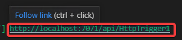

# ハンズオン: Azure Function 「関数アプリ」のデバッグ

F5を押してデバッグを開始する。

以下のようなダイアログが表示される。Learn moreをクリック。

Webブラウザが起動し、以下のような、「Azure Functions Core Tools」インストーラのダウンロード用リンクが表示される。「Windows 64-bit」をクリック。

ダウンロードされたインストーラを起動する。

以降、「Next」をクリックして進めていき、「Install」、「Finish」をクリック。

インストールが完了したら、いったんVisual Studio Codeを再起動する。（すべてのVisual Studio Code のウィンドウを閉じてから、Visual Studio Codeを開く）

Azure Function 関数アプリのプロジェクトのフォルダが開かれた状態であることを確認する。

※もし、フォルダが開かれていない場合は、FileメニューのOpen Folder...から、関数アプリのプロジェクトのフォルダを開く。

F5を押して、関数アプリのデバッグを開始する。

`http://localhost:7071/api/HttpTrigger1` といったような、HTTPトリガーの「関数」のURLが表示される。

コントロールキーを押しながらURLをクリックすると、WebブラウザーでURLを開くことができる。

以下のような画面が出ればOK。

Webブラウザーのアドレス欄をクリックし、そこに表示されている `http://localhost:7071/api/HttpTrigger1` の後ろに「?name=taro」といったようなクエリパラメータを加える。

「name」パラメータに指定した値がメッセージ内に組み込まれて、挨拶文が表示される。

Visual Studio Codeで、「Disconnect」をクリックして、デバッグを終了する。

