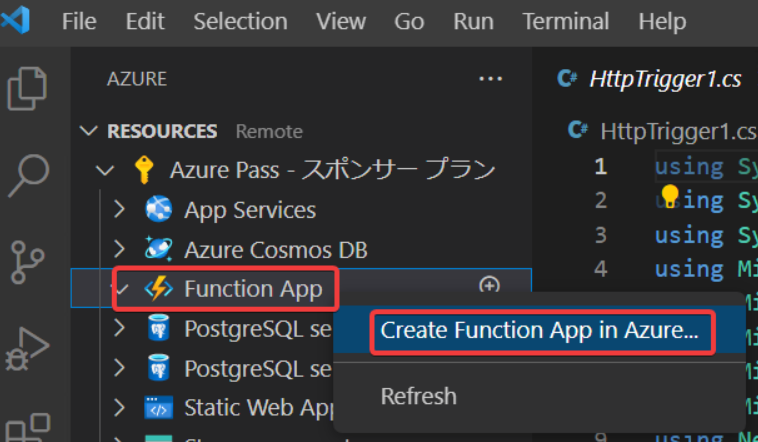

# ハンズオン: Azure Functions 「関数アプリ」のデプロイ

F1 を押し、コマンドパレットで「Create Funciton App in Azure... (Advanced)」を選択する。

（または画面左「Azure」拡張機能アイコンでAzureリソース一覧を表示し、「Function App」を右クリックして「Create Funciton App in Azure... (Advanced)」を選択する。）

- Enter a globally unique name...
  - func（8桁程度の乱数を入力して「func12349876」のような名前にする）
- Select a runtime stack
  - .NET 6 ※「.NET 6 Isolated」ではなく「.NET 6」
- Select an OS
  - Linux
- Select a resource group ...
  - ＋ Create new resource group
- Enter the name of the new resource group...
  - （エンターキーを押してデフォルト値を受け入れる）
- Select a location for new resources
  - East US
- Select a hosting plan
  - Consumption
- Select a storage account
  - ＋ Create new storage account
- Enter the name of the new storage account...
  - （エンターキーを押してデフォルト値を受け入れる）
- Select an Application Insights resource for your app.
  - Skip for now

関数アプリの作成が進行する。しばらく待つ。

RESOURCES以下でAzure Passサブスクリプション、Function App、作成した関数アプリ、Functionsと展開していく。`Deploy to Function App...`をクリック。

`Deploy`をクリック。

画面右下に、以下のようなダイアログが出ればデプロイが成功。ダイアログはしばらくすると消える。

RESOURCES以下でAzure Passサブスクリプション、Function App、作成した関数アプリ、Functionsと展開していく。「HttpTrigger1」がある。右クリックして「Execute Function Now...」

2つの文字列のうち、右側の部分を、適当な名前に書き換えて、エンター。

画面右下に、実行結果が表示される。入力した名前が表示されればOK。

