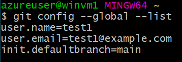

# ハンズオン: Git for Windowsのセットアップ

Webブラウザで以下のサイトを開く。

https://gitforwindows.org/

Downloadをクリック


ダウンロードされたインストーラを開く


「Next」をどんどんクリックしていく。


インストールが完了する。「Finish」をクリック。


画面左下のWindowsアイコン（スタートメニュー）をクリックし、「Git Bash」を起動


以下のコマンドを入力する。

`test1`, `test1@example.com` は、Gitコミット時に記録されるユーザー名とメールアドレス。自分のものを設定する。（または、下記のサンプル通りに入力してもよい）

`init.defaultBranch main` で、デフォルトのブランチ名を`master`ではなく`main`にする。最近はこの名前をブランチ名にすることが多い。

```
git config --global user.name 'test1'
git config --global user.email 'test1@example.com'
git config --global init.defaultBranch main
```

`git config --global --list` で、設定を確認できる。



