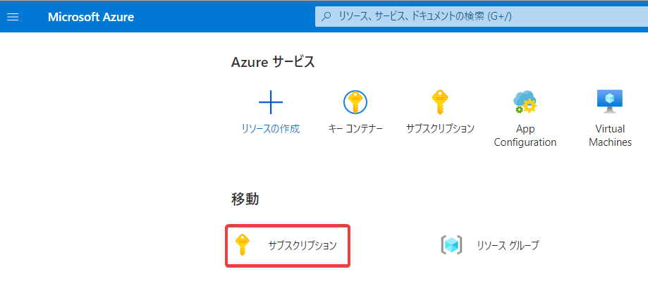
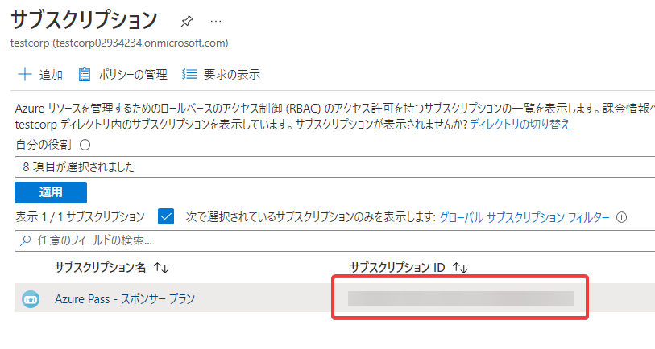
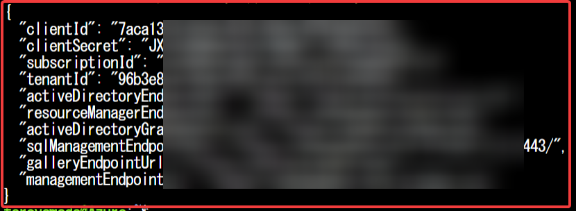
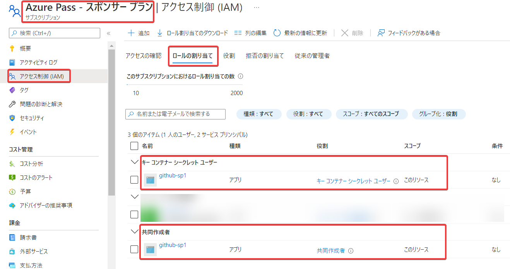

# サービスプリンシパルを作成する

https://github.com/Azure/login#configure-a-service-principal-with-a-secret

サブスクリプションIDを調べる





Cloud Shell (Bash) を起動し、下記スクリプトを投入。

※「サブスクリプションID」は、上記で調べたサブスクリプションIDとする

```
subscription_id='サブスクリプションID'

az ad sp create-for-rbac \
  --name "github-sp1" \
  --role contributor \
  --scopes /subscriptions/"$subscription_id" \
  --sdk-auth
```

※上記コマンド実行時に、「--sdk-auth」オプションがdeprecatedであるという警告が表示される。[公式で対応中の模様。](https://github.com/Azure/login/issues/190)

これで、「github-sp1」というサービスプリンシパルが作成され、サブスクリプションのスコープで [「共同作成者（Contributor）」ロール](https://docs.microsoft.com/en-us/azure/role-based-access-control/built-in-roles#contributor) が割り当てされる。

表示されたJSONをコピーしておく。後ほどGitHubの「repository secret」に設定する。



※上記の他に、割り当てが必要なロールがあれば、以下のようにして追加できる。

例1: ["Key Vault Secret User"（Key Vaultのシークレットユーザー）](https://docs.microsoft.com/en-us/azure/role-based-access-control/built-in-roles#key-vault-secrets-user)

```
az role assignment create \
  --assignee "上記コマンドで出力されたclientIdの値をここに記入" \
  --role "Key Vault Secrets User" \
  --scope /subscriptions/"$subscription_id" 
```

例2: ["App Configuration Data Reader"（App Configuration データ閲覧者）](https://docs.microsoft.com/en-us/azure/role-based-access-control/built-in-roles#app-configuration-data-reader)

```
az role assignment create \
  --assignee "上記コマンドで出力されたclientIdの値をここに記入" \
  --role "App Configuration Data Reader" \
  --scope /subscriptions/"$subscription_id" 
```

割り当て状況は、サブスクリプションの「アクセス制御（IAM）」の「ロールの割り当て」画面で確認できる。



