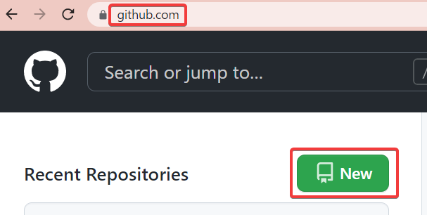
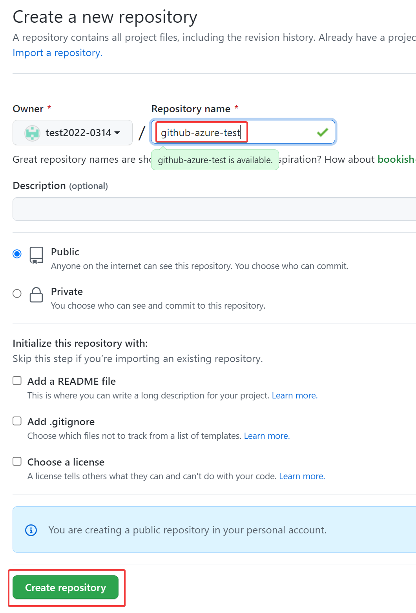
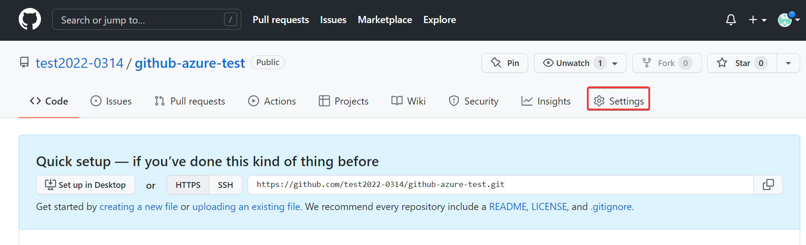
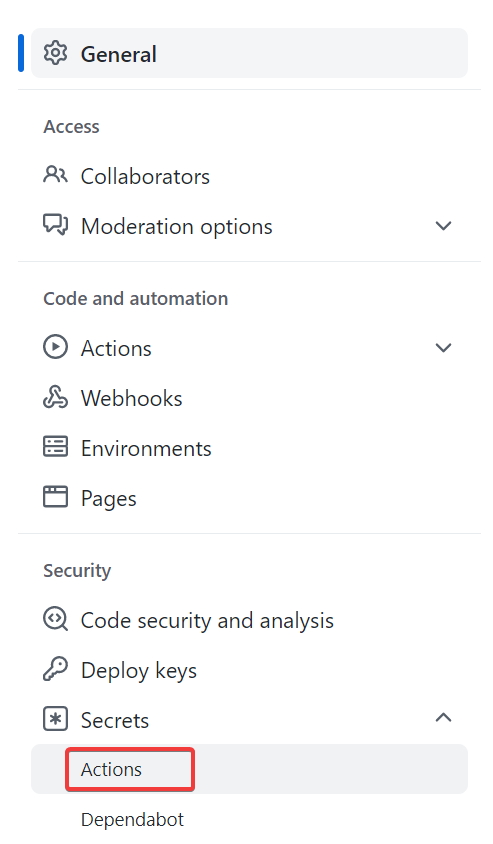
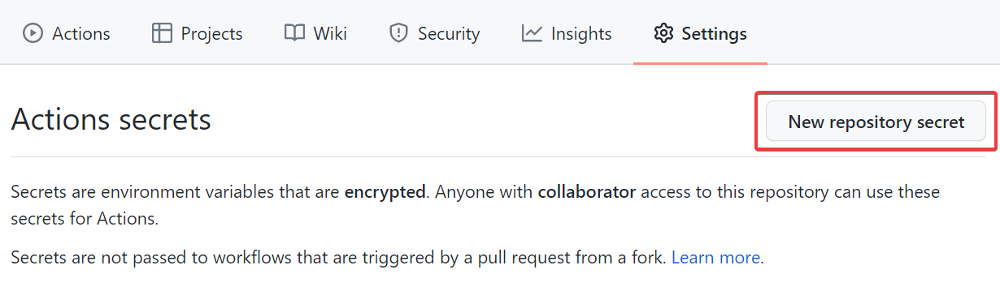
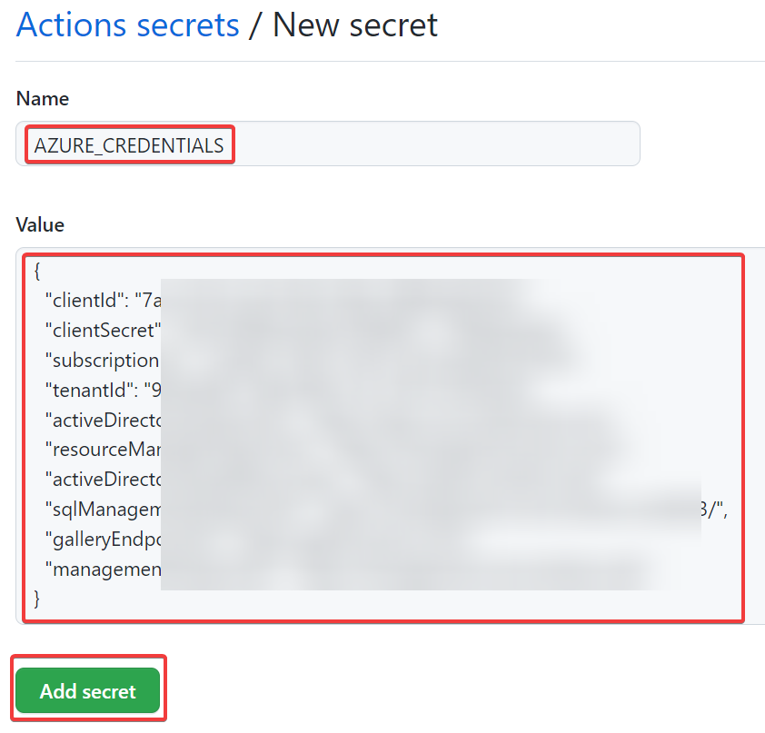
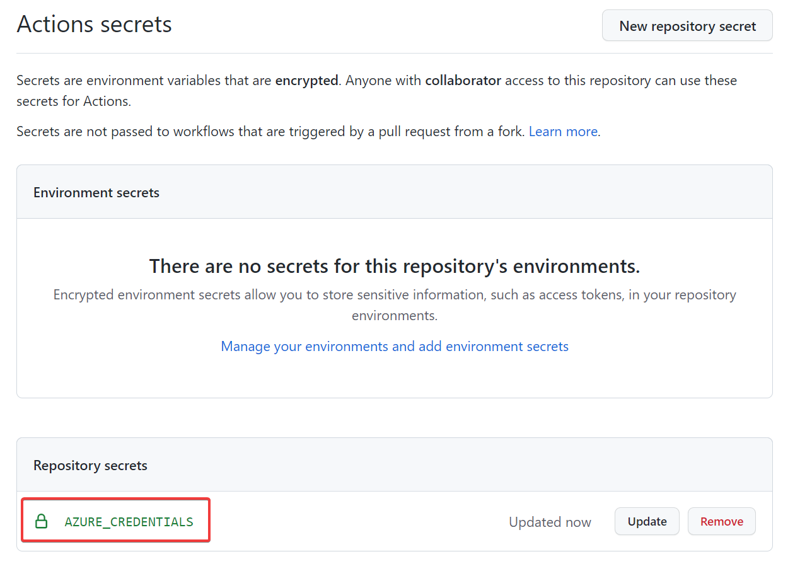

# GitHub リポジトリにシークレットを作成する

https://github.com/Azure/login#configure-a-service-principal-with-a-secret

リポジトリを新規作成する場合:

リポジトリに「AZURE_CREDENTIALS」シークレットを作成。前の工程でサービスプリンシパル作成時に生成されたJSONを貼り付ける。

