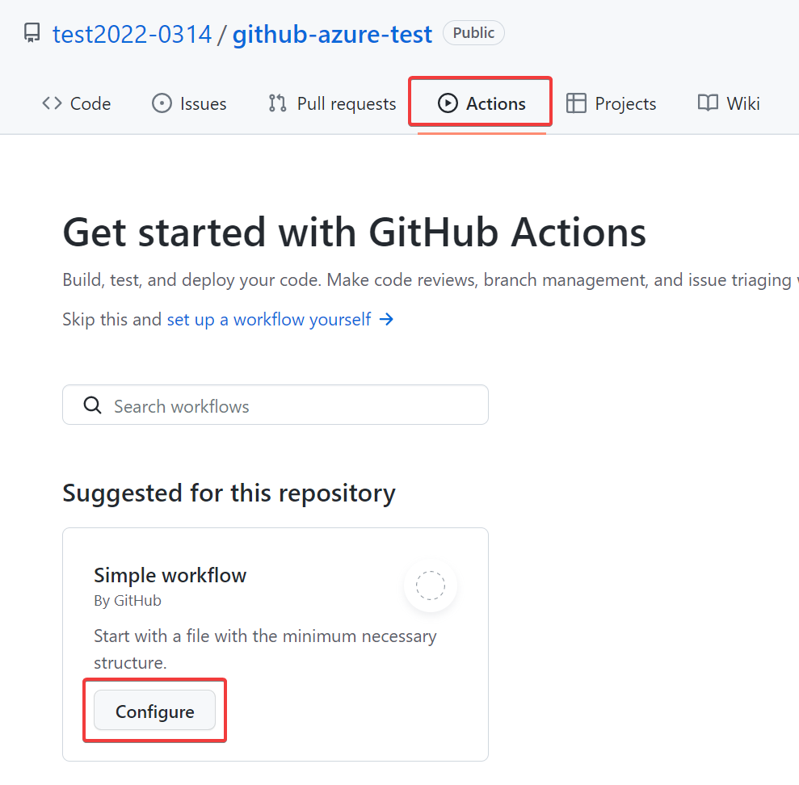
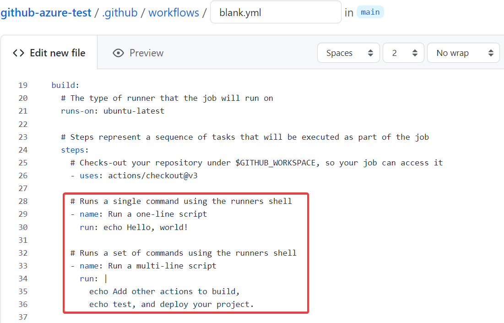
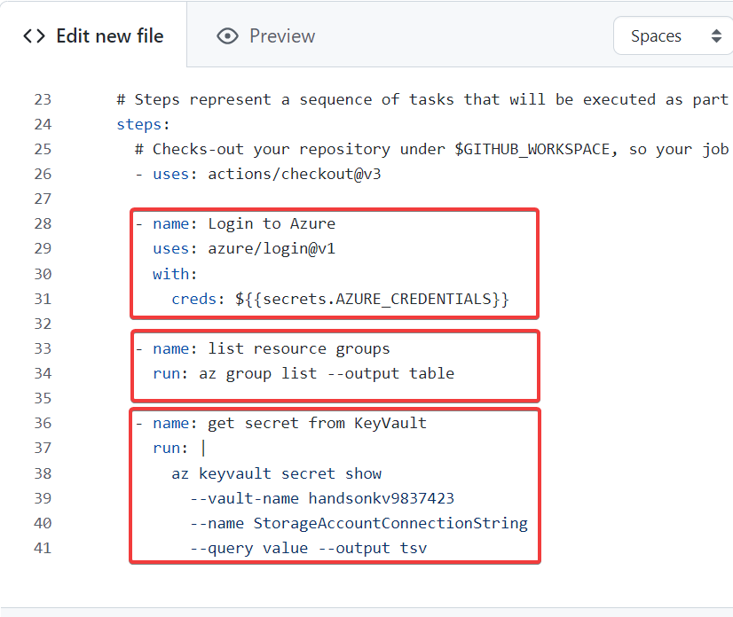
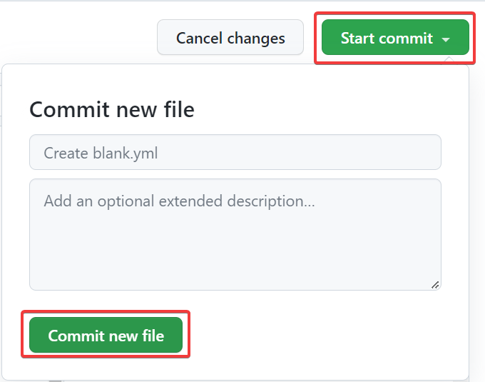
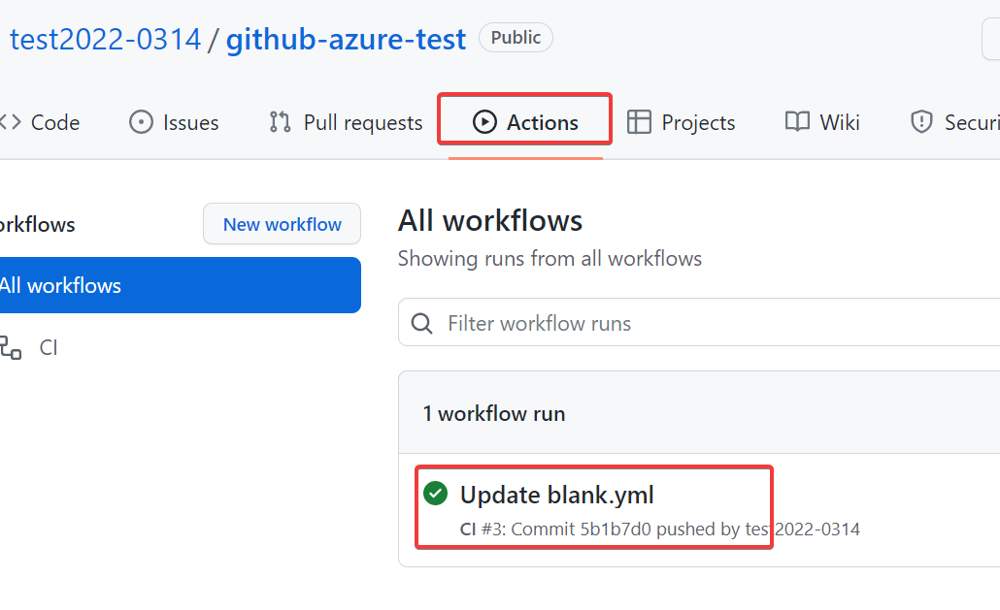
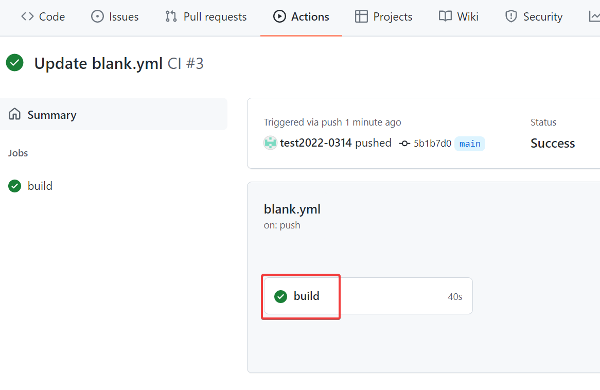
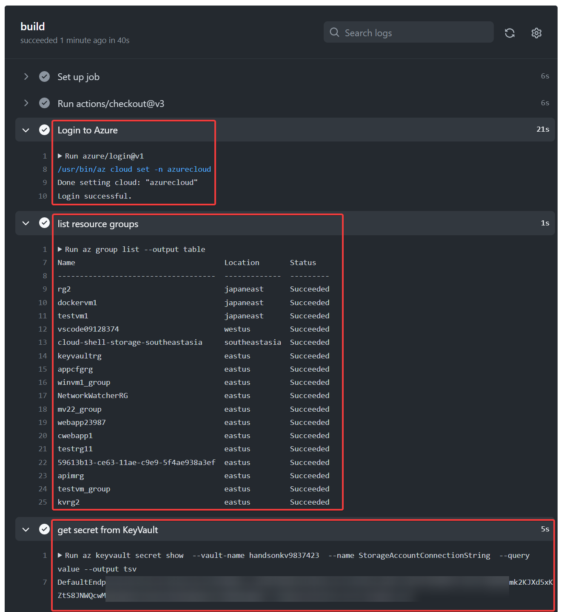

# GitHub Actionsのワークフローを作成



不要な部分を削除




Azureの操作例

- シークレットを使ってAzureにログイン - [azure/login@1 アクション](https://github.com/marketplace/actions/azure-login)を使用
- リソースグループの一覧を取得 - Azure CLIを使用
- Key Vaultのシークレットを取得 - Azure CLIを使用

```
      - name: Login to Azure
        uses: azure/login@v1
        with:
          creds: ${{secrets.AZURE_CREDENTIALS}}
      
      - name: list resource groups
        run: az group list --output table
        
      - name: get secret from KeyVault
        run: >
            az keyvault secret show 
            --vault-name handsonkv9837423 
            --name StorageAccountConnectionString 
            --query value --output tsv
```

※コマンドを複数行で記述する際は 「`>`」 を使用し、続く複数行コマンドは同じインデントにする。









