# テスト用ユーザーの追加

Azure portalにて、Azure Active Directoryへ移動

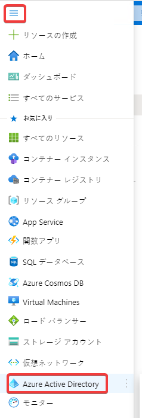

ユーザーを新規作成する。

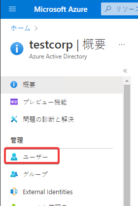

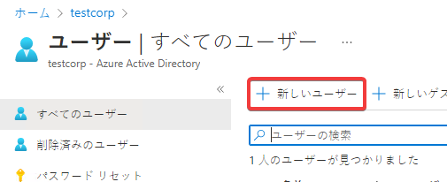

- ユーザー名: 適当に指定
- 名前: 適当に指定
- 初期パスワード: 「自分でパスワードを作成する」にチェック、パスワードを適当に指定。なおこのパスワードはあとですぐに変更が必要となる。

※ユーザー名の右側に表示されている青いボタンをクリックして、UPN（ユーザー名@ドメイン名）をコピーして、メモ帳等に記録しておく。

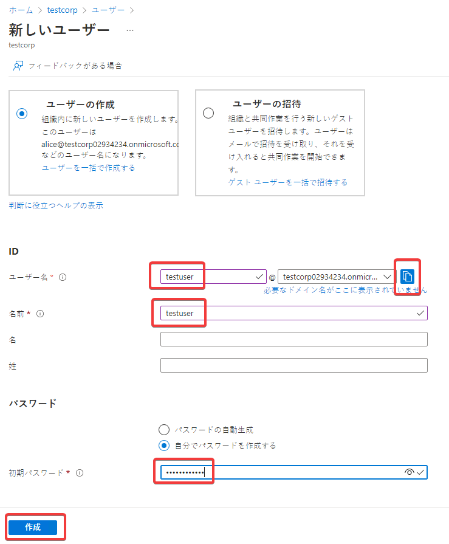

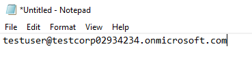

Webブラウザーで Ctrl + Shift + Nを押して、「InPrivate」ウィンドウを開く。

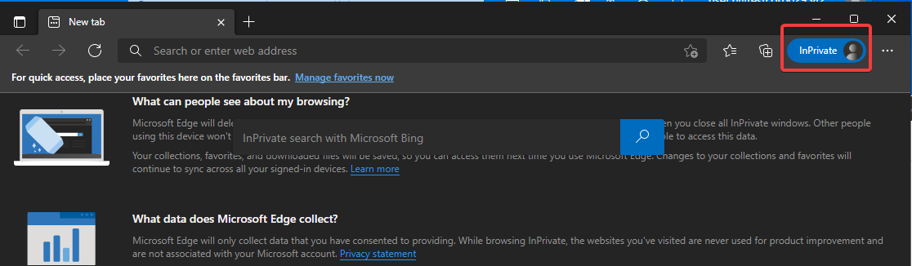

https://portal.azure.com を開く。作成したユーザーでサインインする。

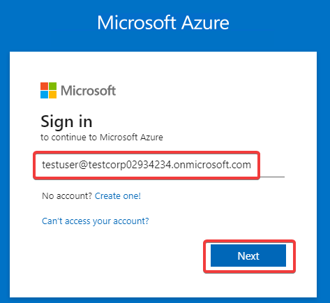

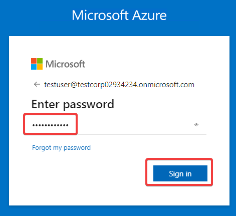

新しいパスワードへの変更を求められる。

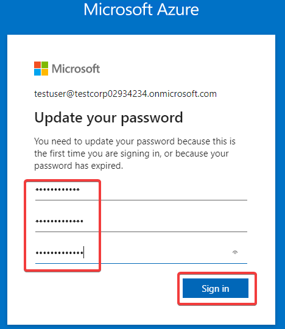

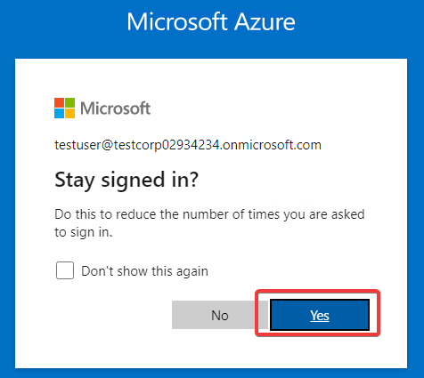

サインインが成功した。ユーザーが準備できたため、この InPrivateウィンドウを閉じる。

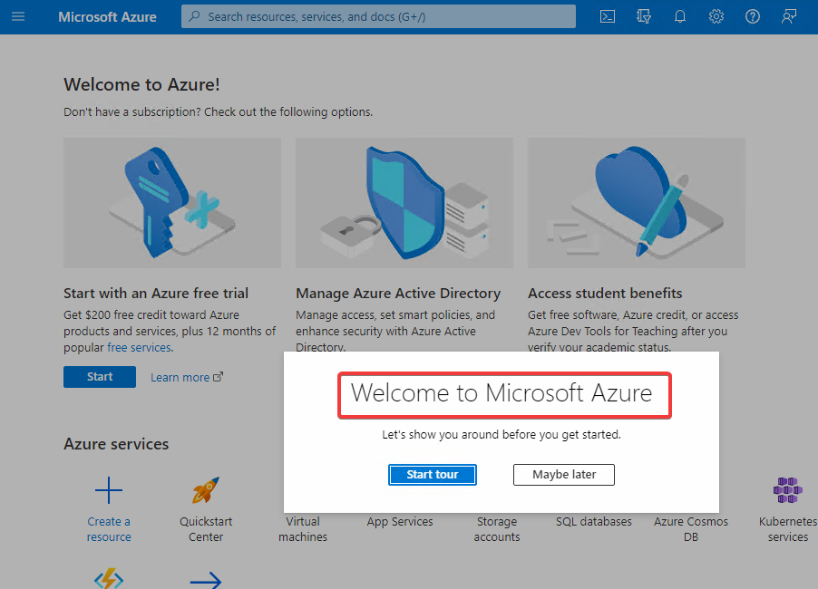