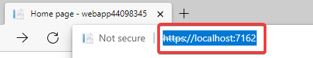

# ハンズオン: Webアプリの作成

Visual Studio Codeのターミナルを開く。


ハンズオン: 「Webアプリの登録」（前の工程）で、作業用ファイルに記録しておいたテキストをコピーし、ターミナルに貼り付けて実行。


続いて、以下のコマンドを投入。新しいWebアプリのプロジェクトが作成され、Visual Studio Codeで開かれる。

```
cd ~/Documents
dotnet new webapp --name "$App" --auth SingleOrg --domain "$Domain" --client-id "$ClientId" --tenant-id "$TenantId"
code -r "$App"
```


Program.cs を開き、17行目付近の
「options.FallbackPolicy = options.DefaultPolicy;」
を
「// options.FallbackPolicy = options.DefaultPolicy;」
と書き換えて、Ctrl-Sで保存する。

※これにより、認証がされていなくてもWebサイトにアクセスできるようになる（認証はオプションとなる）。


F1でコマンドパレットを出し、「build」と入力し、「.NET: Generate Assets for Build and Debug」を選ぶ。


Program.csを開いた状態で、F5を押して、デバッグ実行を開始。

ブラウザが表示される。


ここで、そのままサインインに進むと、現在の（トレーニング開始時に作成したMicrosoftアカウントの）ユーザーでログインしようとしてしまう。テスト用に作成したAzure ADユーザーでサインインするため、InPrivateウィンドウを開く。

Webアプリのアドレスをコピーする。



Ctrl + Shift + NでInPrivateウィンドウを開き、アドレスを貼り付けてアクセスする。


サインインが要求される。テスト用に作成したユーザーのID,パスワードを入力。


Permission requiredと表示される。これは、このアプリが、サインインするユーザーの情報を読み取る許可を、ユーザーに求めている。Acceptをクリックする。


※参考: 日本語UIの場合は、「要求されているアクセス許可」: 「承諾」をクリック。


サインインが完了した。


画面右上「Sign out」をクリックして、サインアウトできる。


今回のアプリでは、「// options.FallbackPolicy = options.DefaultPolicy;」により、サインインをしていない状態でもWebアプリにアクセスできるように設定したが、このコードを有効にする（// を外す）ことで、サインインしなければ一切Webアプリにアクセスできないようにすることもできる。

# トラブルシューティング

■サインイン時に「申し訳ありませんが、サインイン中に問題が発生しました。」「AADSTS700054: response_type 'id_token' is not enabled for the application.」または「AADSTS50011: The redirect URI 'https://localhost:7077/signin-oidc' specified in the request does not match the redirect URIs configured for the application 'c53d052b-8bd5-4f16-b436-e216f7e42ccd'. Make sure the redirect URI sent in the request matches one added to your application in the Azure portal. Navigate to https://aka.ms/redirectUriMismatchError to learn more about how to fix this.」というエラーが発生。

→Azure ADに登録したアプリの「認証」をクリック。「＋プラットフォームを追加」の下に「Web」があれば、その枠の右上のゴミ箱アイコンをクリックして「Web」を削除。「＋プラットフォームを追加」をクリック、「Web」、アプリケーションのリダイレクトURIに「https://localhost/signin-oidc」を指定。「承認エンドポイントによって発行してほしいトークンを選択してください。」で「IDトークン」にチェック。「構成」。

# コードの解説

このプロジェクトには、認証に必要となるライブラリ（Microsoft.Identity.Web等）がすでに組み込まれている。


`dotnet new webapp`コマンドで指定された、ドメイン、クライアントID、テナントIDなどは、appsettings.json に記載されている。※設定が間違っている場合はここを修正する。


`Program.cs` には、認証に必要なセットアップを行うコードが組み込まれている。


`_LoginPartial.cshtml` に、サインイン、サインアウト、ユーザー名を表示するコードが含まれている。


