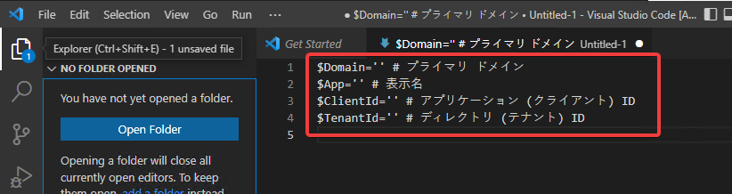
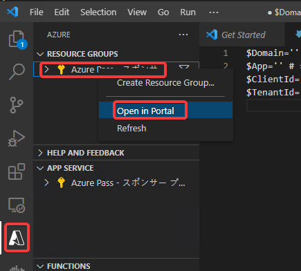
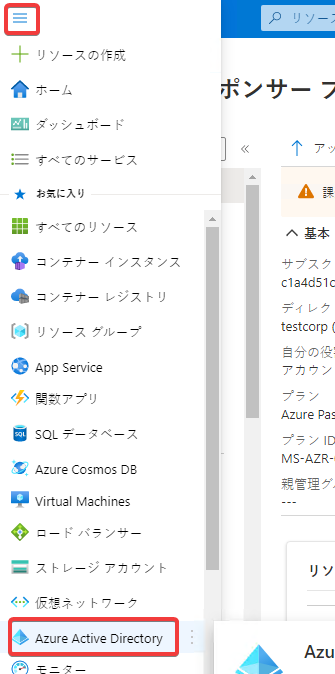
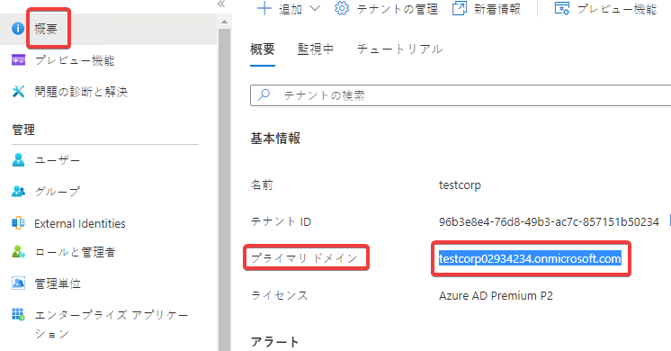
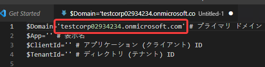
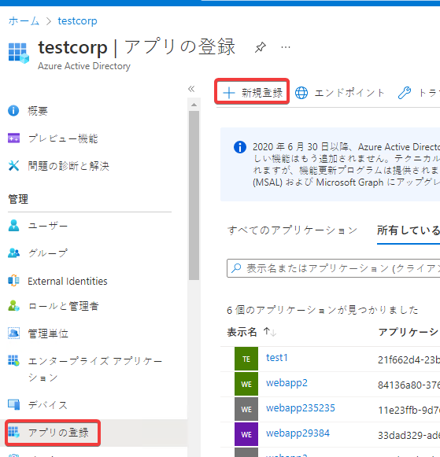
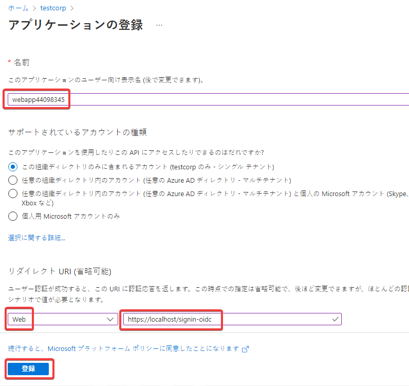
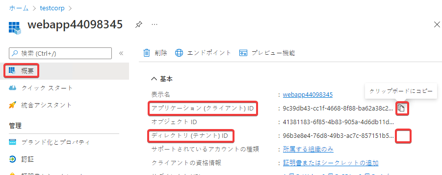
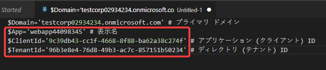
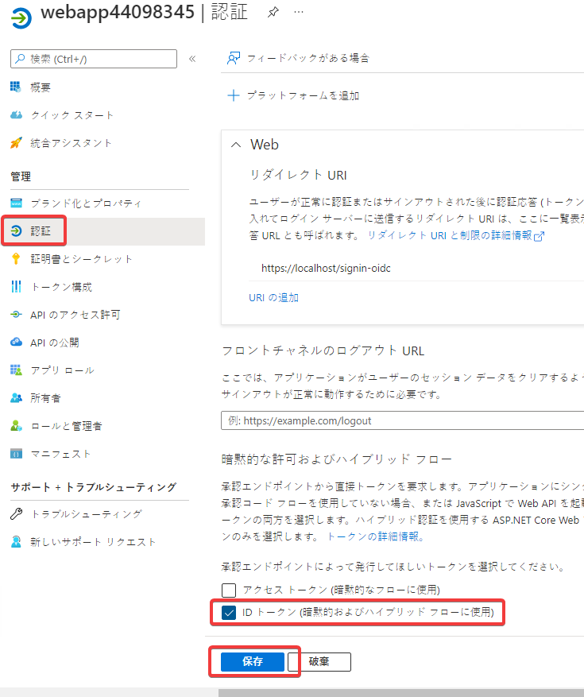

# ハンズオン: 「Webアプリの登録」

ハンズオンのVM内で作業を行う。

Visual Studio Codeを起動する。

Ctrl + Shift + N で、Visual Studio Codeの新しいウィンドウを開く。

Ctrl + N で、新しい作業用ファイルを作成する。

以下のテキストを貼り付ける。

```
$Domain='' # プライマリ ドメイン
$App='' # 表示名
$ClientId='' # アプリケーション (クライアント) ID
$TenantId='' # ディレクトリ (テナント) ID
```



Azure AD アプリの登録を行う。Azure portalに移動。



Azure Active Directoryを表示



「概要」で、「プライマリ ドメイン」をコピーし、メモ帳に記録。





「アプリの登録」で、「＋新規登録」をクリック。



- 名前: webapp(乱数)
- リダイレクト URI (省略可能): Web, https://localhost/signin-oidc

「登録」をクリック。



「表示名」「アプリケーション (クライアント) ID」「ディレクトリ (テナント) ID」をコピーし、作業用ファイルに記録。





作業用ファイルを「Documents」以下に「app.ps」として保存。

「認証」をクリック。

承認エンドポイントによって発行してほしいトークンを選択してください。: 「ID トークン」 にチェック。



「保存」をクリック。
