# Windows VM (Windows Server 2022) 文字化けの解消

以下のような入出力を行うコードを実行する。
```c#
Console.WriteLine("Hello, World!あいうえお");
var s = Console.ReadLine();
Console.WriteLine(s);
```

普通にVisual Studio Code上のターミナル（PowerShell）で実行すると、文字化けしてしまう。

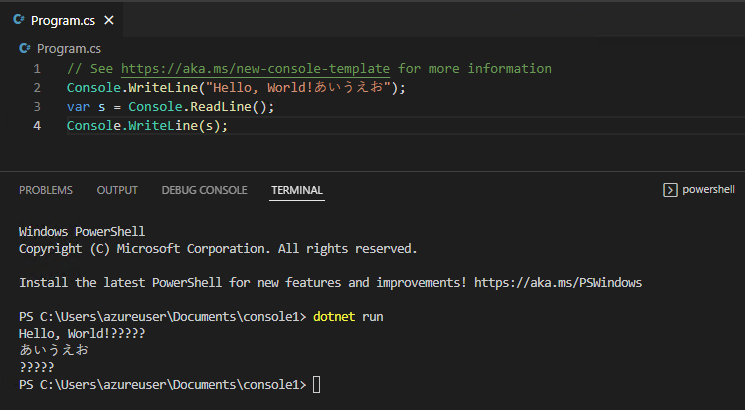

# chcp 65001（失敗）

[ネットで検索](https://www.google.com/search?q=visual+studio+code+chcp+65001) すると、「`chcp 65001` コマンドを投入すると解消する」という情報が多く見つかるが・・・

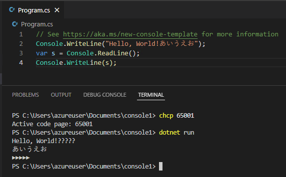

# Git for Windows の Git Bash

[Git for Windows](https://gitforwindows.org/)をインストール。

スタートメニューから Git Bash を起動。

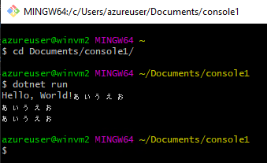

# コマンドプロンプト

スタートメニューから コマンドプロンプト を起動。

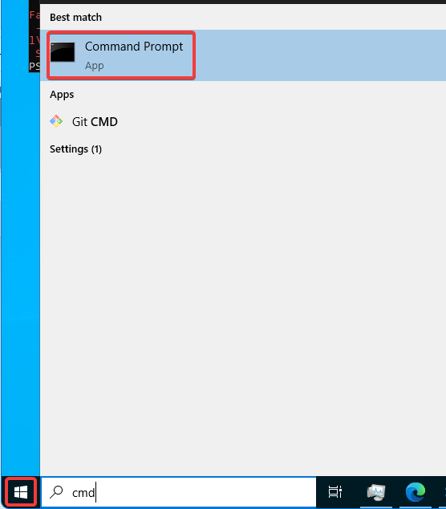

`chcp 932`を実行後、`dotnet run`

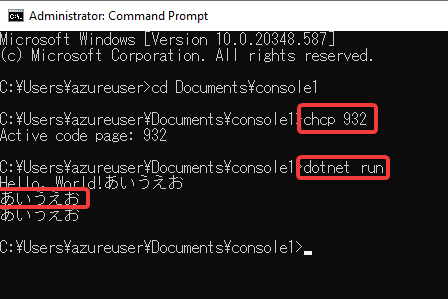

# Visual Studio Code

F1, `Terminal: Create New Terminal (With Profile)`

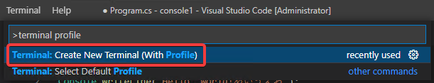

Command Promptを選択

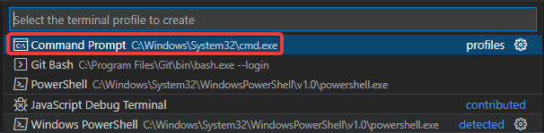

`chcp 932`を実行後、`dotnet run`

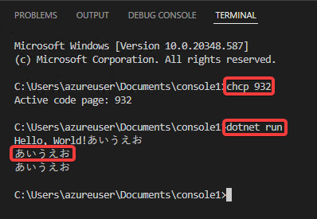

# システムロケールの変更

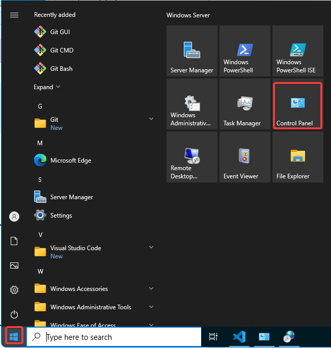

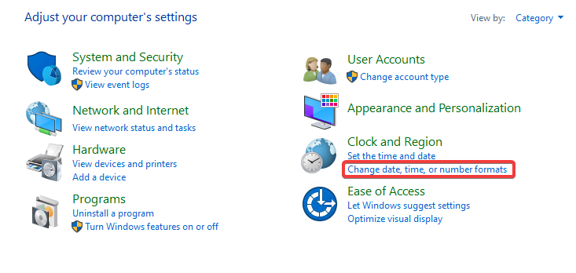

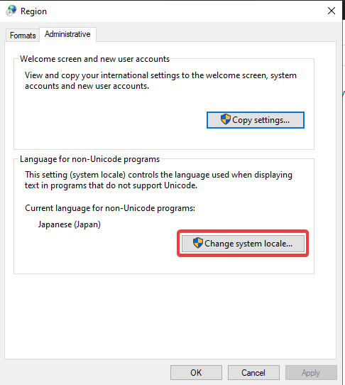

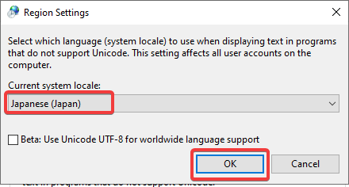

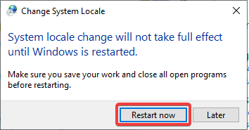

再起動後

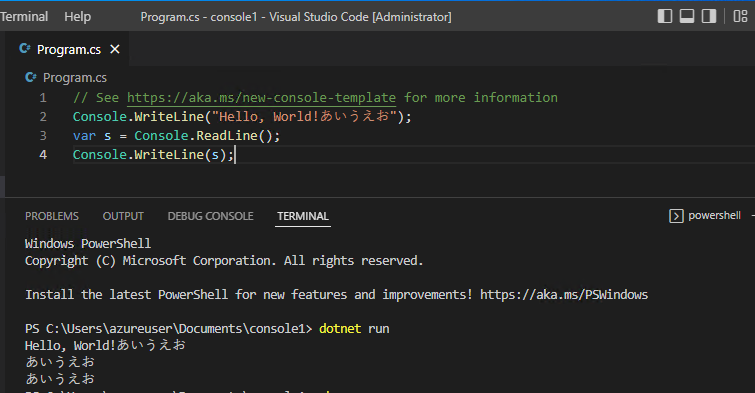