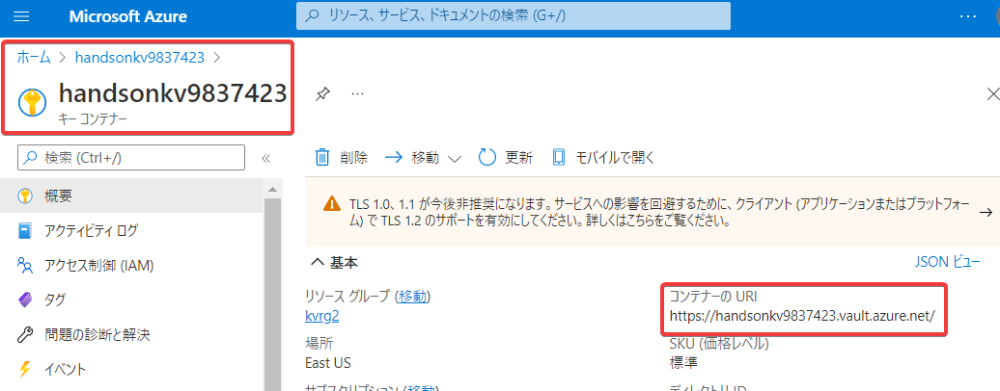
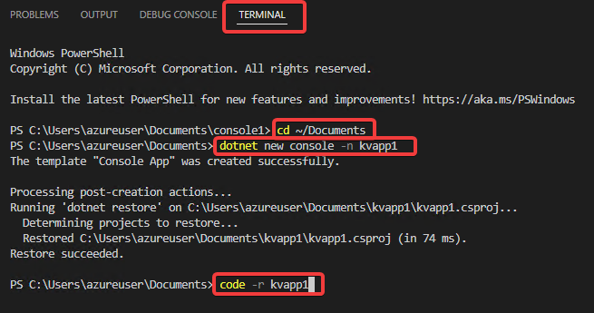
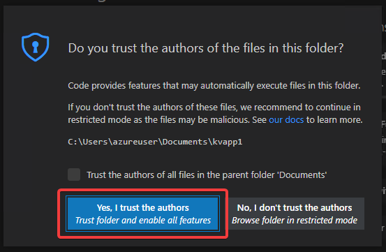
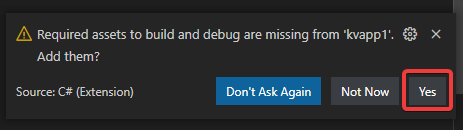
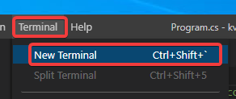
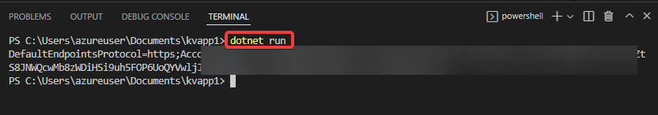

# ハンズオン: Key Vaultからシークレットを取得するクライアント

Key Vaultの「概要」の「コンテナーのURI」を調べておく。



Visual Studio Code (Windows VM）のターミナルで以下を実行。

```
cd ~/Documents
dotnet new console -n kvapp1
code -r kvapp1
```







ターミナルを起動



以下のコマンドを投入
```
dotnet add package azure.identity
dotnet add package azure.security.keyvault.secrets
```

`Program.cs` を開き、中身を以下のように書き換える。

Uri("")の部分に、Key Vaultの「概要」の「コンテナーのURI」をセットする。

```c#
using Azure.Identity;
using Azure.Security.KeyVault.Secrets;

var cred = new DefaultAzureCredential();
var uri = new Uri(""); // Key Vaultの「概要」の「コンテナーのURI」をセット
var secretClient = new SecretClient(uri, cred);
var result = secretClient.GetSecret("StorageAccountConnectionString");
Console.WriteLine(result.Value.Value);
```

ターミナルで `dotnet run`を実行。

Key Vaultのシークレットにセットした「接続文字列」が取得できればOK。

