# VMにマネージドIDを割り当てる

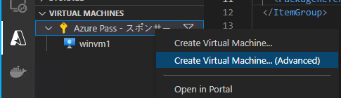

- Enter a name for the new virtual machine
  - testvm1
- Select an OS
  - Linux
- Select an image
  - Ubuntu Server 20.04 LTS
- Enter a username
  - azureuser
- Enter a passphrase for connecting to this virtual machine
  - 何も入れずにエンターキーを押す
- Select a location for new resources
  - Japan East

作成が終わるまでしばらく待つ。

作成されたVMを右クリックして「Connect to Host via Remote SSH」

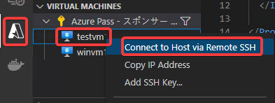

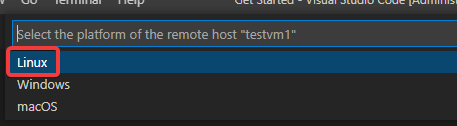

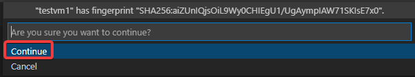

ターミナルを開く。

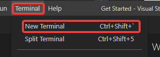

以下のコマンドを投入。[参考](https://docs.microsoft.com/ja-jp/azure/active-directory/managed-identities-azure-resources/how-to-use-vm-token#get-a-token-using-http)

```
curl -H Metadata:true --noproxy "*" "http://169.254.169.254/metadata/identity/oauth2/token?api-version=2018-02-01&resource=https://management.azure.com/" > noid.json
```

続いて、noid.json を開く。

```
code noid.json
```

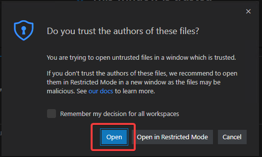

結果は

`{"error":"invalid_request","error_description":"Identity not found"}` 

となっている。つまり、マネージドIDが割り当てられていないので、トークンが取得できない。

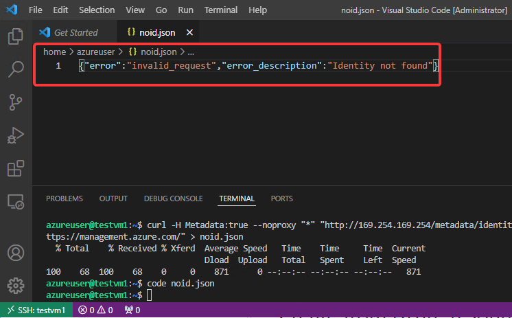

いったん、SSH接続されたVisual Studio Codeのウィンドウを閉じる。

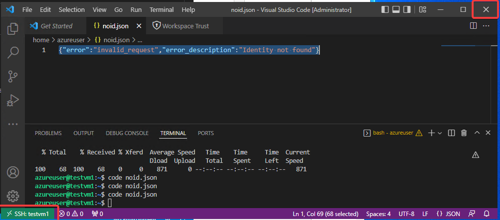

マネージドIDを割り当てるため、testvm1をAzure portalで開く。

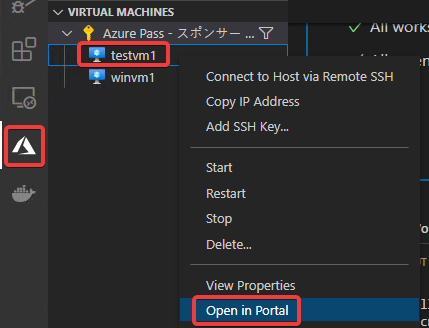

設定＞ID に移動。「システム割り当て済み」の「状態」で「オン」をクリックし、保存する。

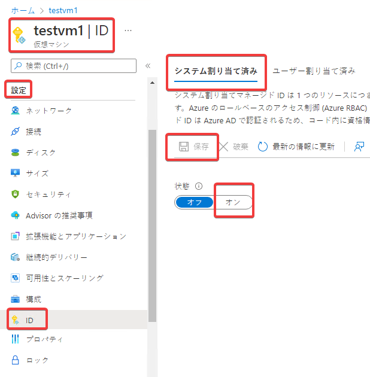

「はい」

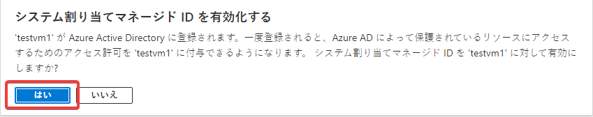

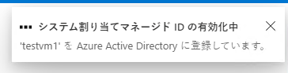

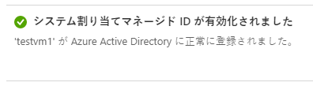


Visual Studio Codeに戻り、再度、「testvm1」に「Connect to Host via Remote SSH」で接続する。


ターミナルを開く。


再度、同様のコマンドを投入。[参考](https://docs.microsoft.com/ja-jp/azure/active-directory/managed-identities-azure-resources/how-to-use-vm-token#get-a-token-using-http)

```
curl -H Metadata:true --noproxy "*" "http://169.254.169.254/metadata/identity/oauth2/token?api-version=2018-02-01&resource=https://management.azure.com/" > managedid.json
```

続いて、managedid.json を開く。

```
code managedid.json
```

今度は、以下のような結果となり、トークンが取得できていることが確認できる。

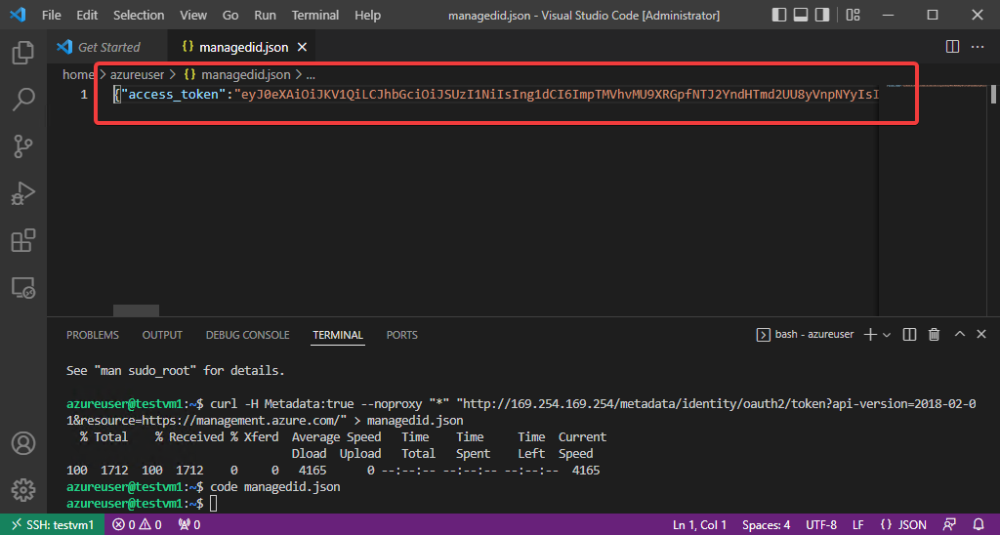

`"access_token":"eyJ..."` の `eyJ` で始まる文字列をコピー。

https://jwt.ms/ に文字列を貼り付けると、この文字列をデコードし、トークンに含まれているクレームを確認することができる。

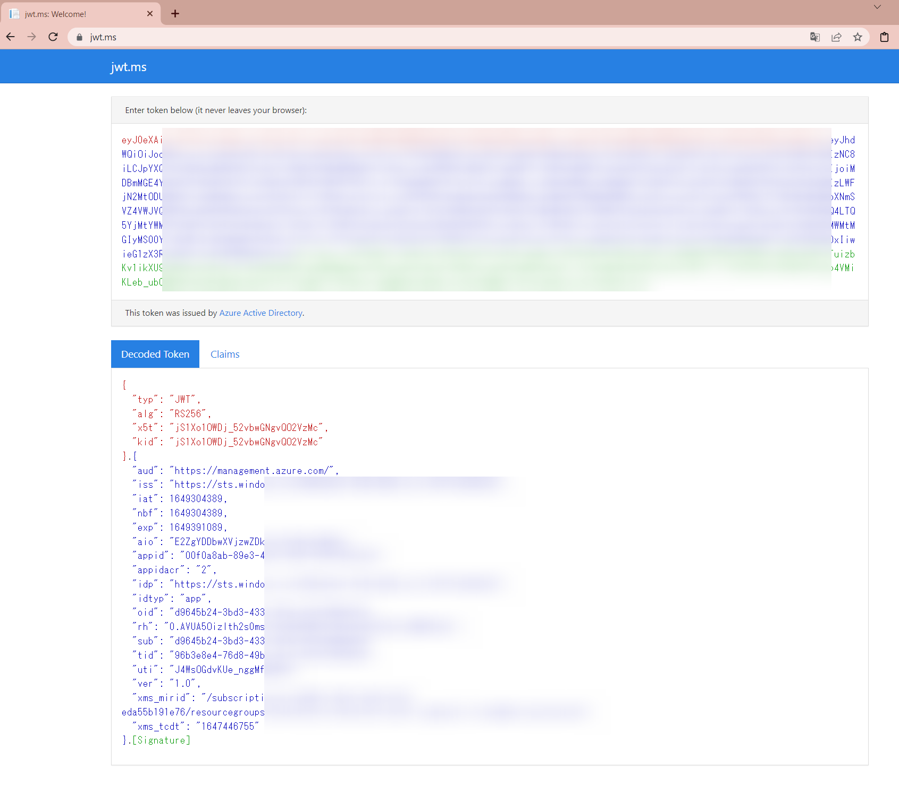

トークンはAzure ADから発行されている。

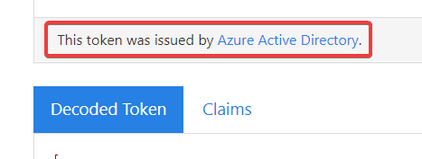

結論: VMに「マネージドID」を割り当てると、VM内から `http://169.254.169.254/metadata/identity/oauth2/token` にアクセスして、トークンを取得することができるようになる。