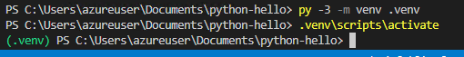
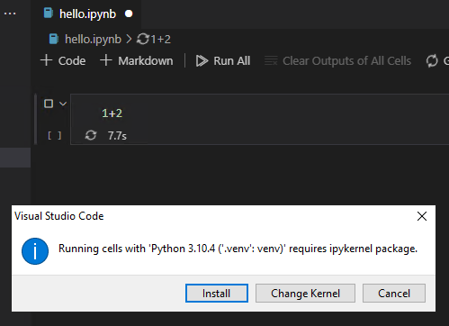
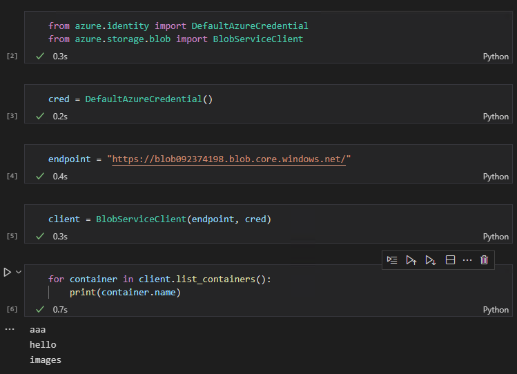

# Python + Azure

https://docs.microsoft.com/ja-jp/azure/developer/python/azure-sdk-overview

https://docs.microsoft.com/ja-jp/azure/developer/python/configure-local-development-environment?tabs=cmd


# Pythonのセットアップ

- Python 3.10.4
  - https://www.python.org/downloads/
  - インストール中に「環境変数への追加」を選ぶ
- Visual Studio CodeにPython拡張機能 (Microsoft)を入れる
  - https://marketplace.visualstudio.com/items?itemName=ms-python.python
- hello world を実行
  - https://docs.microsoft.com/ja-jp/learn/modules/python-install-vscode/6-exercise-first-application?pivots=windows

# Python仮想環境を使用する

https://docs.microsoft.com/ja-jp/azure/developer/python/configure-local-development-environment?tabs=cmd#use-python-virtual-environments



# ライブラリのインストール

https://docs.microsoft.com/ja-jp/azure/developer/python/azure-sdk-library-usage-patterns?tabs=pip#library-installation

```sh
pip install azure-storage-blob
```
# 認証

https://docs.microsoft.com/ja-jp/azure/developer/python/azure-sdk-authenticate

https://docs.microsoft.com/en-us/python/api/overview/azure/identity-readme?view=azure-python

```sh
pip install azure-identity
```

# Microsoft公式サンプルコード集

https://docs.microsoft.com/en-us/samples/azure/azure-sdk-for-python/storage-blob-samples/


# コード例: Blobコンテナーの一覧表示

```python
from azure.identity import DefaultAzureCredential
from azure.storage.blob import BlobServiceClient

cred = DefaultAzureCredential()
endpoint = "https://blob092374198.blob.core.windows.net/"

client = BlobServiceClient(endpoint, cred)

for container in client.list_containers():
    print(container.name)
```

# Jupyter notebook

.ipynb 拡張子を付けたファイルを作成して開く。セルに適当な式を入れて実行する。



必要なパッケージが入る。あとは普通にプログラミングできる。

