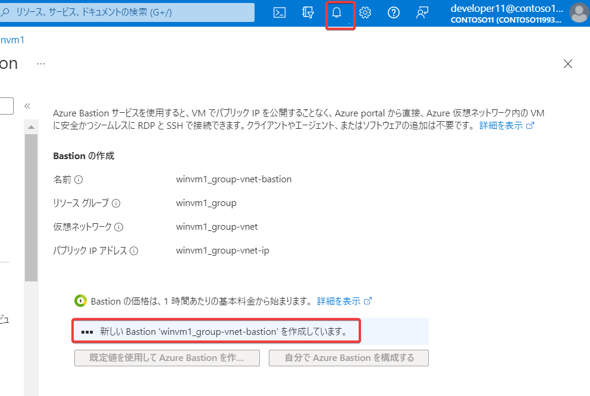

# Azure Bastionによる接続

VMを表示し、接続＞Bastion

既定値を使用してBastionを作成する

（画面右上に通知が出る）

（Bastionの作成が完了するまでしばらく待つ。5分ほどかかる）

ユーザー名とパスワードを入力して「接続」をクリック。Webブラウザーで新しいタブが開き、Windows Serverへの接続が始まる。

「ポップアップ ブロックが原因で新しいウィンドウを開くことができません。ポップアップを許可してから再試行してください。」が表示された場合は・・・

Webブラウザーのポップアップ ブロックの通知をクリックし、「～のポップアップとリダイレクトを常に許可する」を選択して「完了」。（※Google Chromeの場合。Webブラウザーによっては異なる表示になる場合がある）

「～が次の許可を求めています」「クリップボードにコピーしたテキストや画像へのアクセス」というポップアップが表示されたら「許可する」をクリック。

画面右側に「Networks」が表示されたら「Yes」をクリック

Server Managerの「Don't show this message again」にチェック、Server Managerを閉じる

以上で、Azure Bastionを使用してWindows Serverに接続できた。

