# ハンズオン: Windows VMへのリモートデスクトップ接続

VMの「概要」で「接続」をクリックし、「RDP」をクリック

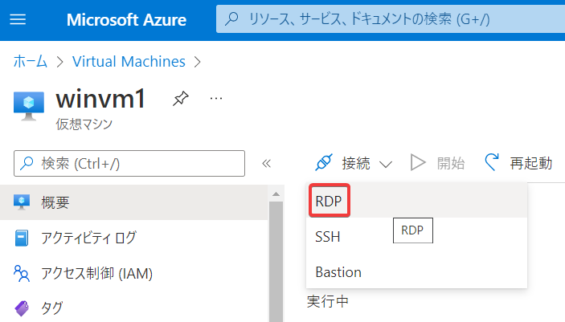

「RDPファイルのダウンロード」

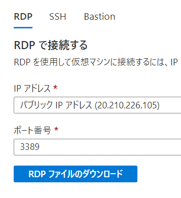

ダウンロードされたRDPファイルを右クリック。

Windows 11の場合、以下のようなメニューが出るので「その他のオプションを表示」をクリック

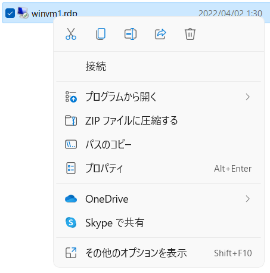

「編集」をクリック

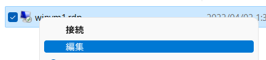

ユーザー名に、VMを作成した際に指定したユーザー名（`azureuser`）を入力。

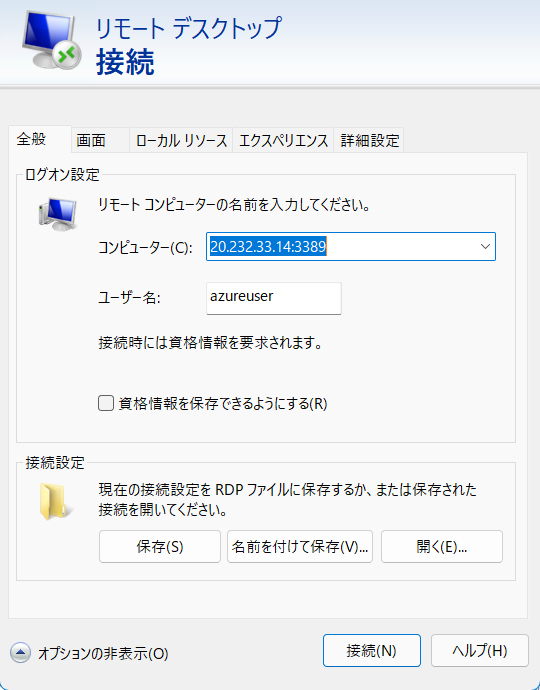

「画面」タブをクリックし、画面サイズを「1920 x 1080」に指定

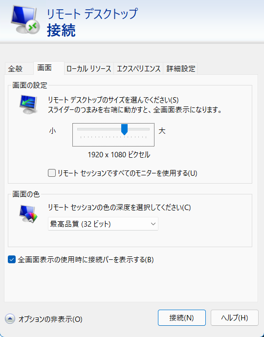

「全般」タブに戻り、「保存」をクリックし、「接続」

「接続」をクリック

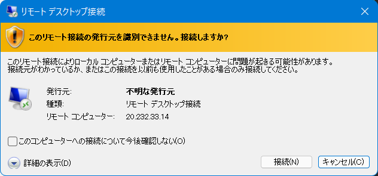

「接続しています」画面が出る。少し待つ。

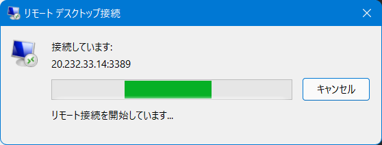

「資格情報を入力してください」が表示される。VMを作成した際に指定したパスワードを入力。

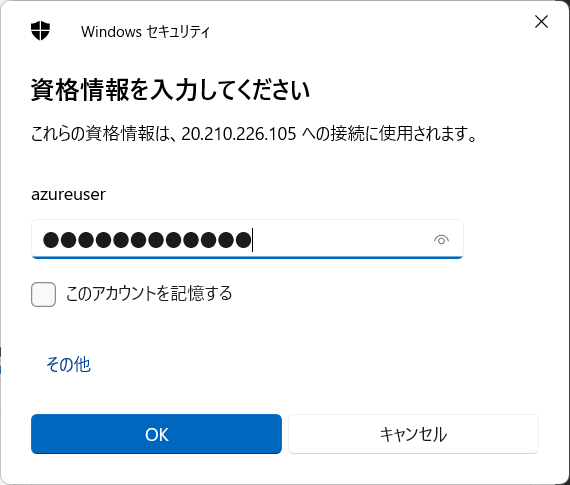

「はい」

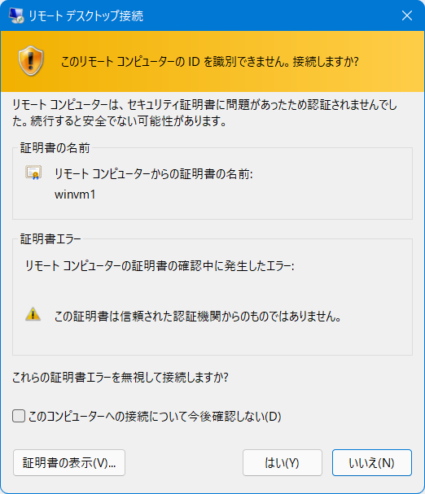

リモートデスクトップが起動する。少し待つ。

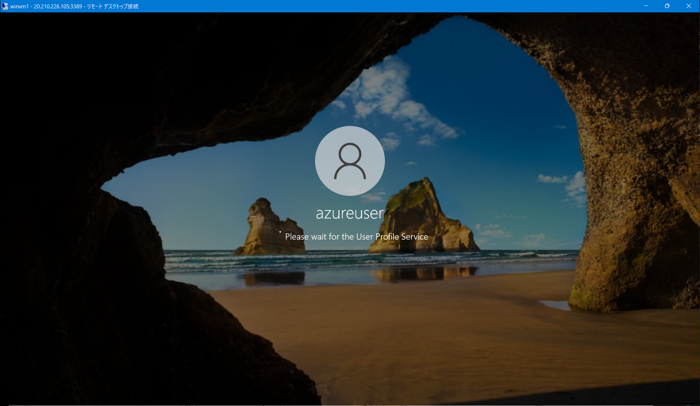

画面右側に「Network」「Do you want to allow your PC to be discoverable by other PCs and devices on this network?」と表示される。「Yes」をクリック。

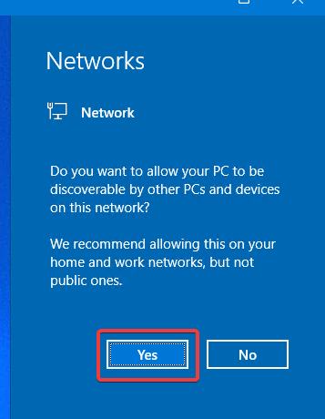

しばらくして「Server Manager」が起動する。ダイアログの「Don't show this message again」にチェックして、ダイアログ右上の「✕」をクリック

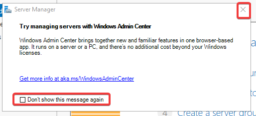

「Server Manager」のウィンドウの右上の「✕」をクリックして、「Server Manager」を閉じる。

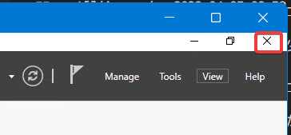

以上で、Windows VMにRDP接続ができた。

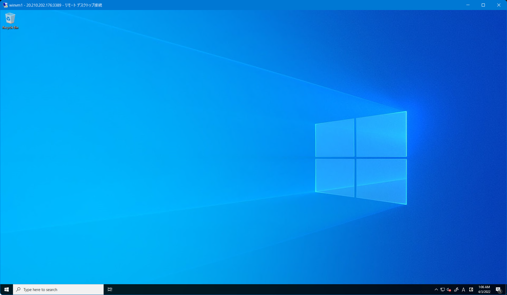