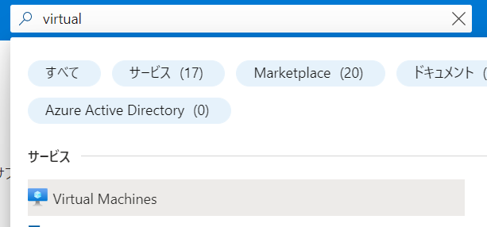
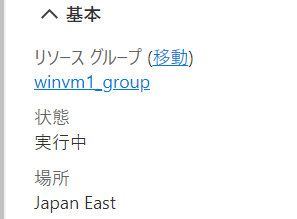
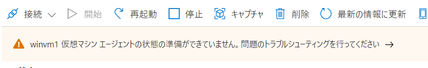

# ハンズオン: Windows 仮想マシン(VM) の作成

WebブラウザでAzure portalを開く
https://portal.azure.com/

画面上部の検索で「virtual」と検索して「Virtual Machines」をクリック

「＋作成」、「Azure仮想マシン」をクリック

以下の項目を入力する。その他はデフォルト値とする。

- リソースグループ名: 新規作成、名前: winvm1_group
- 仮想マシン名: winvm1
- 地域: (Asia Pacific) Japan East
- 可用性オプション: インフラストラクチャ冗長は必要ありません
- イメージ: Windows Server 2022 Datacenter: Azure Edition - x64 Gen2
  - ※クリックして選択したイメージがプルダウンにうまく表示されない場合があるが問題ない
- サイズ: すべてのサイズを表示、D2s_v5 で検索し、「Dシリーズ v5」を展開して D2as_v5 をクリックして「選択」。選択後は Standard_D2as_v5 と表示される。※「使用できないサイズ」などと表示されて選択できない場合は、類似の、使用できるサイズ (E2as_v5, D2as_v4 など) を選択して進める。
- ユーザー名: azureuser
- パスワード, パスワードの確認: （自分でパスワードを決めて入力）
  - 単純なパスワード（`password` など）や、それに近いもの（`P@ssw0rd123!`など）は使わないこと！すぐにハッキングされます！！

「確認及び作成」、「作成」をクリック

「デプロイが進行中です」と表示される。1～2分待つ。

「デプロイが完了しました」と表示される。「リソースに移動」をクリック。

作成した仮想マシンが表示される。「状態」が「実行中」であればOK。

「仮想マシンエージェントの状態の準備ができていません」というメッセージが出る場合があるが、これは放置して問題ない。（起動してから1分ほど経過してから、他のメニューをクリックして画面遷移し、また「概要」メニューをクリックすると、メッセージは消える）

