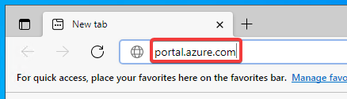
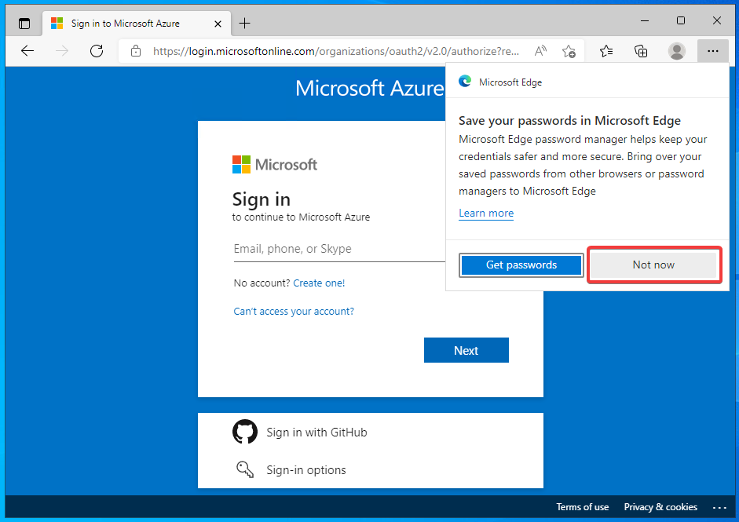
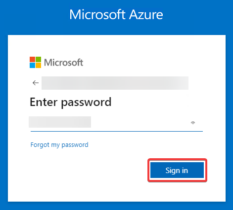
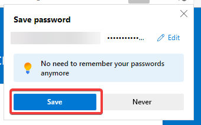
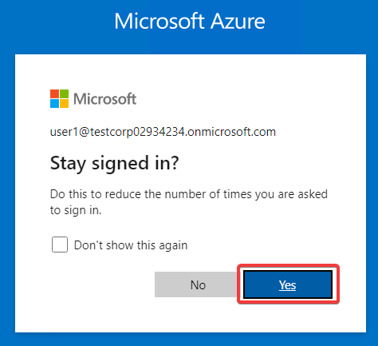
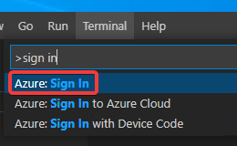
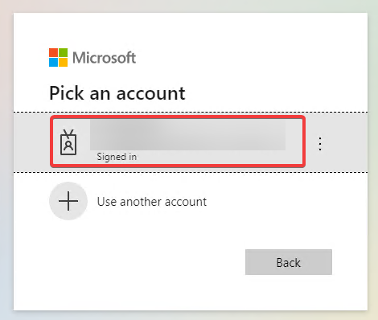
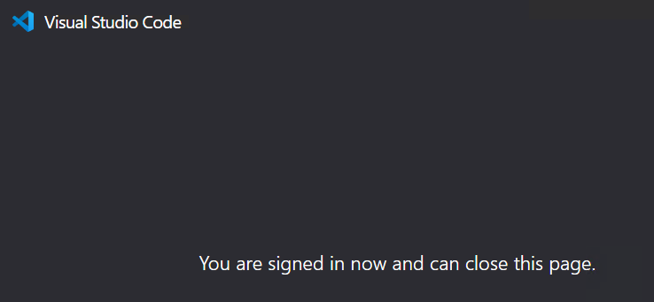
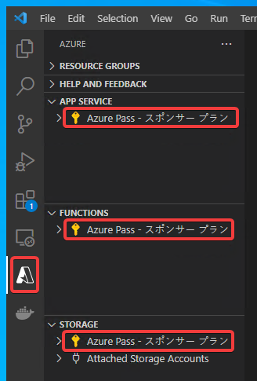

# ハンズオン: Azureへのサインイン

Visual Studio Codeの拡張機能を使用して、Azureにサインインする。

その前に、Webブラウザ（Edge）でサインインを済ませておくとスムーズである。

Webブラウザ（Edge）を開き、以下のサイトを開く。

https://portal.azure.com/

Azure portalのサインイン画面が表示される。

※Edgeの「Save your passwords...」といったダイアログが表示された場合は「Not now」をクリック。

トレーニング開始時に作成したMicrosoftアカウントでサインインを行う。

「Save passwords」が表示されたら「Save」をクリック。

「Stay signed in?」が表示されたら「Yes」をクリック。

Azure portalにサインインできた。「Translate ...?」が表示された場合は「Not now」をクリック。

続いて、Visual Studio Code 側で操作を行う。

F1を押し（または「Ctrl + Shift + P」を押し）て、コマンドパレットを開き、`sign in`と入力し、「Azure: Sign In」をクリックする。

Webブラウザで先程サインインしたアカウントが表示されるはずである。そのアカウントをクリックする。

「You are signed in now...」と表示される。このブラウザ（タブ）は閉じてよい。

Visual Studio Code画面左側「Azure」拡張機能のボタンをクリックし、「APP SERVICE」等の区画内に、「Azure pass」といったサブスクリプション名が表示されていれば、サインインが正しく完了している。

