# ハンズオン: ストレージアカウントを作成する

Azure拡張機能をクリックする。STORAGE内のAzureサブスクリプションを右クリックし、「Create Storage Account...(Advanced)」をクリックする。

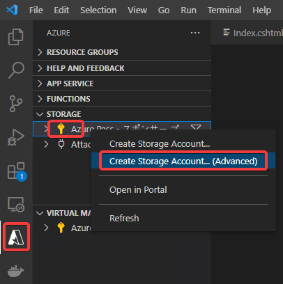

「Enter a globally unique name ...」: ストレージアカウントの適当な名前を入力。`st`＋ランダムな数 など。

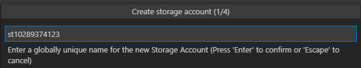

「Select a resource group...」: 「＋Create new resource group」

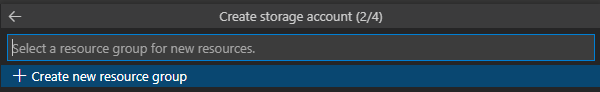

ストレージアカウント名と同じリソースグループ名がデフォルトで入力される。エンターキーを押す。

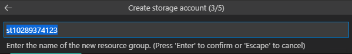

No

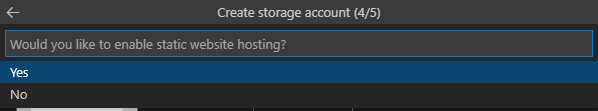

「Select a location ...」→「East US」

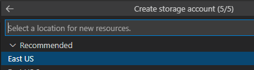

画面右下に「Creating...」と出る。しばらく待つ。

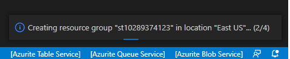

STORAGE内のAzureサブスクリプションを展開すると、作成したストレージアカウントが追加されている。

※「cs～～」というストレージアカウントは、Azure portalでCloud Shellを使用した際に作成されるもの。

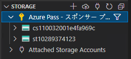

ストレージアカウントの中の「Blob Containers」を右クリックし、Create Blob Container...をクリック。

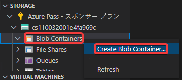

「images」と入力。

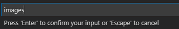

imagesコンテナーが作成された。

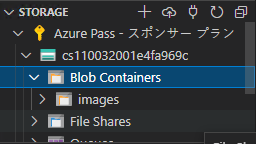

