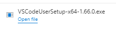

# ハンズオン: Visual Studio Codeのインストール

Webブラウザで以下のサイトを開く。

https://code.visualstudio.com/

ダウンロードボタンをクリック

ダウンロードされたインストーラを開く

※Windows Serverに管理者でログインして作業している場合は、以下のような警告が出てくるが、「OK」をクリックしてよい。

「I accept the agreement」をクリックし、「Next」をどんどんクリックしてインストールを進める。

「Finish」

Visual Studioが起動する。

起動したら、タスクバーでVisual Studio Codeのアイコンを右クリックし、「ピン止め」（Pin to taskbar）しておくと、アプリケーションを終了してもアイコンが表示され続けるので便利。

