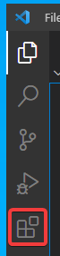
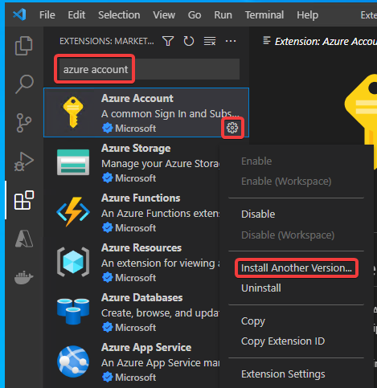
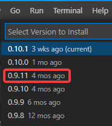
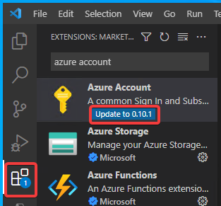

# 「Azure Account」拡張機能のダウングレード

Visual Studio Codeを起動する。

Visual Studio Codeの「拡張機能」アイコンをクリックする。

[一時的な問題に対する回避策](https://github.com/Azure/azure-sdk-for-net/issues/27263)として、「Azure Account」拡張機能のバージョンを最新バージョンから「0.9.11」にダウングレードする。

「Azure Account」拡張機能（これは上記「Azure Tools」に含まれている）を検索し、歯車アイコンをクリックして、「Install Another Version...」をクリック

古いバージョンである「0.9.11」をインストールする。

「0.9.11」のインストールが完了すると、拡張機能アイコンに青い丸と数字が出る。またAzure Account拡張機能に「Update to ...」というボタンが出る。これらは無視すること。（Upgrade to ...ボタンをクリックしないこと）

