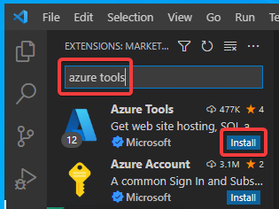
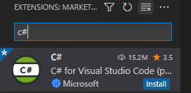
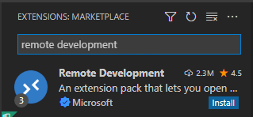

# Visual Studio Code 拡張機能のインストール

Visual Studio Codeを起動する。

Visual Studio Codeの「拡張機能」アイコンをクリックする。

「Azure Tools」を検索し、インストールする。インストールが完了するまで1分ほど待つ。

以上で「Azure Tools」拡張機能のインストールは完了。

同様の手順で「C#」拡張機能をインストールする。

さらに「Remote Development」拡張機能をインストールする。

