# Webアプリの作成

.NET (C#) を使用して、「ASP.NET Core」のWebアプリを作成する。

「Visual Studio Code」が起動している場合は、いったん終了させて、再度起動する。これにより、「Visual Studio Code」ターミナル内で「code」コマンドが利用できるようになる。

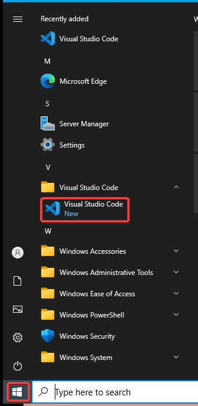

※Visual Studio Codeの画面下部の「ステータスバー」が紫色で表示されていることに着目。これは、まだ特定のフォルダを開いていない状態であることを表す。

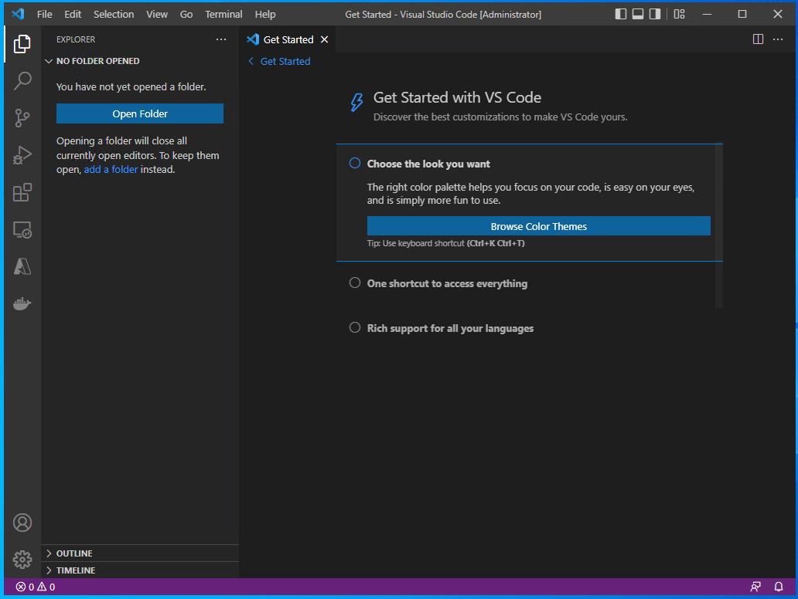

Terminalメニューから「New Terminal」を選択

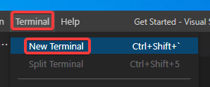

画面下部にターミナルが開く。

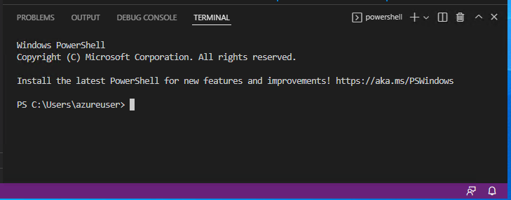

`dotnet --version`と入力。`6.0.301`といった、インストール済みの .NET のバージョンが表示されるはずである。

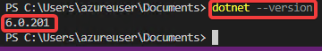

これ以外の表示が出てしまう場合（バージョン6 以外のバージョンが表示されたり、コマンドがエラーになってしまう場合）は、いったんすべての Visual Studio Codeウィンドウを閉じ、再び開いて、再度コマンドを試すこと。

それでもだめな場合は .NET のインストールができていないので、.NET のインストールをやり直す。

正しくバージョンが表示された場合、続いて、`cd ~/Documents`と入力。「~」は「半角のチルダ」である。

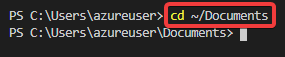

`dotnet new webapp -n webapp1`と入力。

Webアプリ(webapp)のプロジェクト「webapp1」のフォルダが作成され、必要なファイルが生成される。

`code -r webapp1`と入力。

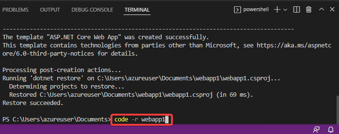

Visual Studio Codeのウィンドウがリロードされる。

※画面下のステータスバーは青色になる。Visual Studio Codeで、あるフォルダを開いて、作業しているという状態である。

以下のような画面が表示された場合は、「Yes, I trust the authors」をクリック。

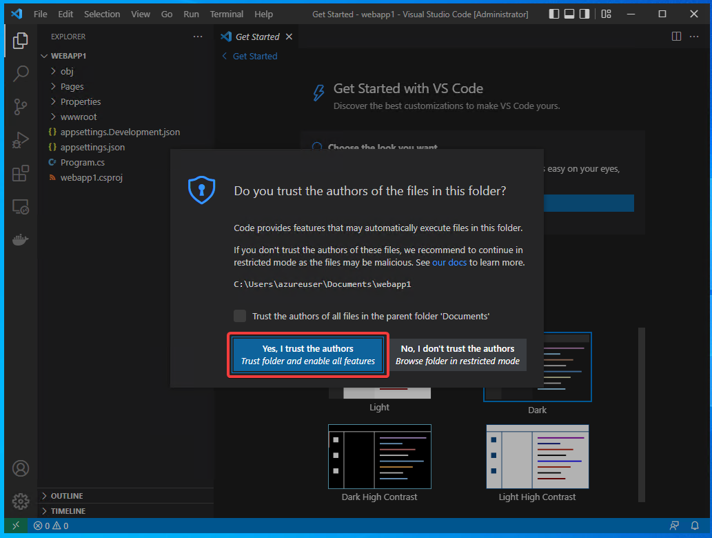

Visual Studio Codeの左下に「炎」のアイコンが表示されている。アイコンが黄色から白に変化するまで30秒ほど待つ。

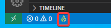

アイコンが白に変化すると、続いて以下のような「Required assets to build and debug are missing from ～～. Add them?」と表示される。「Yes」をクリック。

※このダイアログはしばらくすると勝手に消えてしまう。「Yes」をクリックする前に消えてしまった場合は次の手順を参照。

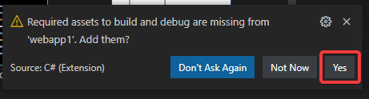

※上記のダイアログが「Yes」をクリックする前に消えてしまった場合: 「F1」キー（または Ctrl + Shift + P）を押し、「build」と打ち込むと、「.NET: Generate Assets for Build and Debug」というメニューが表示されるので、それをクリックすると、上記ダイアログで「Yes」をクリックしたのと同じ状態になる。

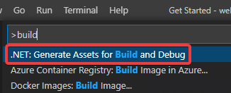

