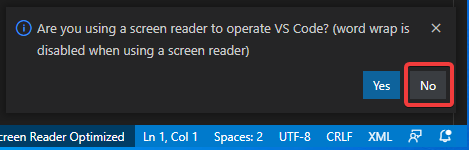
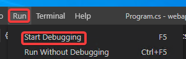
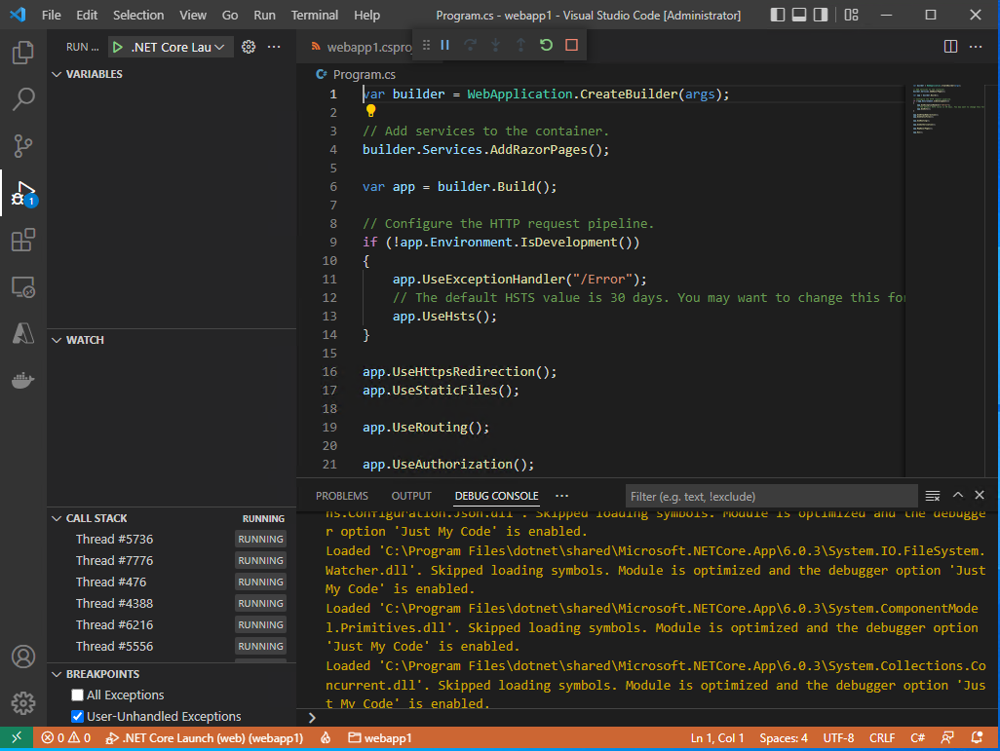
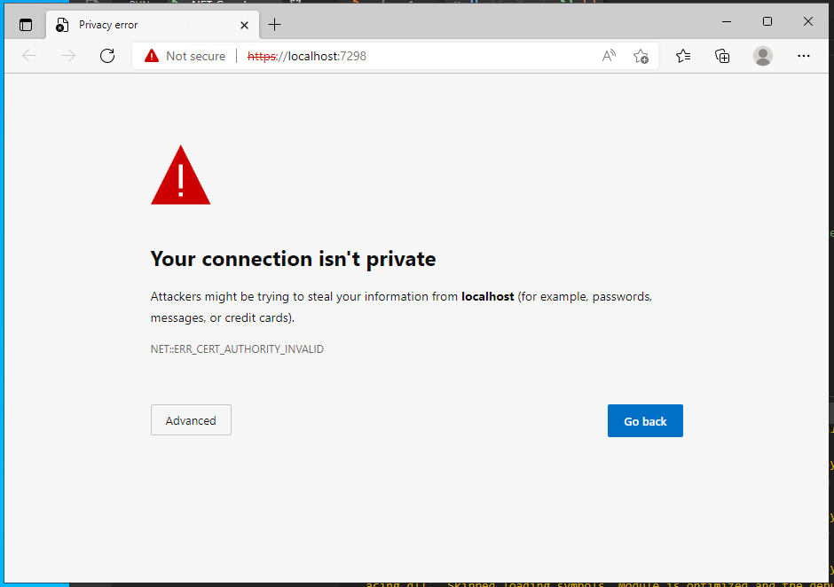
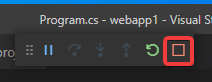
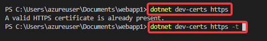
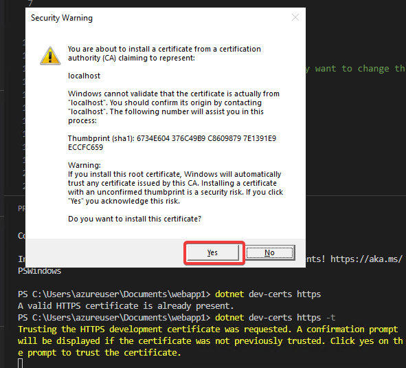
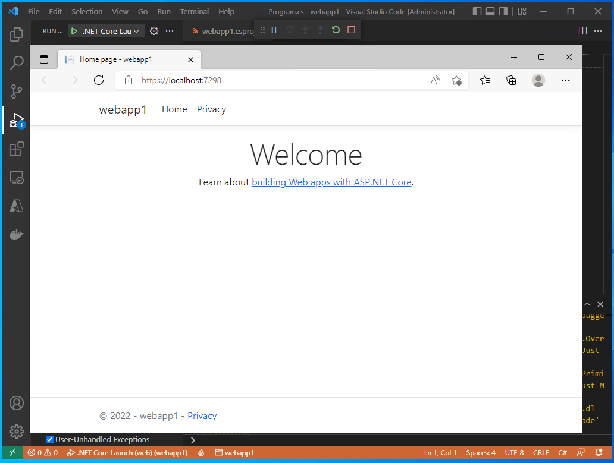
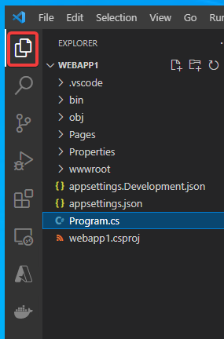

# Webアプリの作成

.NET (C#) を使用して、「ASP.NET Core」のWebアプリを作成する。

「Visual Studio Code」を起動する。

※Visual Studio Codeの画面下部の「ステータスバー」が紫色で表示されていることに着目。これは、まだ特定のフォルダを開いていない状態であることを表す。

Terminalメニューから「New Terminal」を選択

画面下部にターミナルが開く。

`dotnet --version`と入力。`6.0.201`といった、インストール済みの .NET のバージョンが表示されるはずである。

これ以外の表示が出てしまう場合（バージョン6 以外のバージョンが表示されたり、コマンドがエラーになってしまう場合）は、いったんすべての Visual Studio Codeウィンドウを閉じ、再び開いて、再度コマンドを試すこと。

それでもだめな場合は .NET のインストールができていないので、.NET のインストールをやり直す。

正しくバージョンが表示された場合、続いて、`cd ~/Documents`と入力。「~」は「半角のチルダ」である。

`dotnet new webapp -n webapp1`と入力。

Webアプリ(webapp)のプロジェクト「webapp1」のフォルダが作成され、必要なファイルが生成される。

`code -r webapp1`と入力。

Visual Studio Codeのウィンドウがリロードされる。

※画面下のステータスバーは青色になる。Visual Studio Codeで、あるフォルダを開いて、作業しているという状態である。

以下のような画面が表示された場合は、「Yes, I trust the authors」をクリック。

Visual Studio Codeの左下に「炎」のアイコンが表示されている。アイコンが黄色から白に変化するまで30秒ほど待つ。

アイコンが白に変化すると、続いて以下のような「Required assets to build and debug are missing from ～～. Add them?」と表示される。「Yes」をクリック。

※このダイアログはしばらくすると勝手に消えてしまう。「Yes」をクリックする前に消えてしまった場合は次の手順を参照。

※上記のダイアログが「Yes」をクリックする前に消えてしまった場合: 「F1」キー（または Ctrl + Shift + P）を押し、「build」と打ち込むと、「.NET: Generate Assets for Build and Debug」というメニューが表示されるので、それをクリックすると、上記ダイアログで「Yes」をクリックしたのと同じ状態になる。

続いて、画面左側のファイル一覧で、「Program.cs」を開く。

以下のようなダイアログ「Are you using a screen reader ... ?」が出た場合は「No」をクリック。

「F5」を押すか、「Run」メニューの「Start Debugging」を選択して、「デバッグ」を開始する。

Visual Studio Codeの画面は以下のようになる。

※デバッグ中はステータスバーがオレンジ色になる。

同時にWebブラウザ（Edge）が開くが、以下のような「Your connection isn't private」という表示となる。

いったんWebブラウザを閉じ、Visual Studio Code側では「□」をクリックして、「デバッグ」を終了する。

Terminalメニューから「New Terminal」を選択

`dotnet dev-certs https`と打ってエンター。

続いて`dotnet dev-certs https -t`と打ってエンター。

すると以下のような画面が出るので、Yesをクリック。

再度、F5を押して「デバッグ」を開始すると、以下のようなサンプルのWebアプリが表示される。

以上で、Webアプリの作成と実行ができた。

Webブラウザを閉じ、「デバッグ」を終了する。

画面左側の「Explorer」アイコン（一番上）をクリックすると、ファイル一覧の表示になる。

