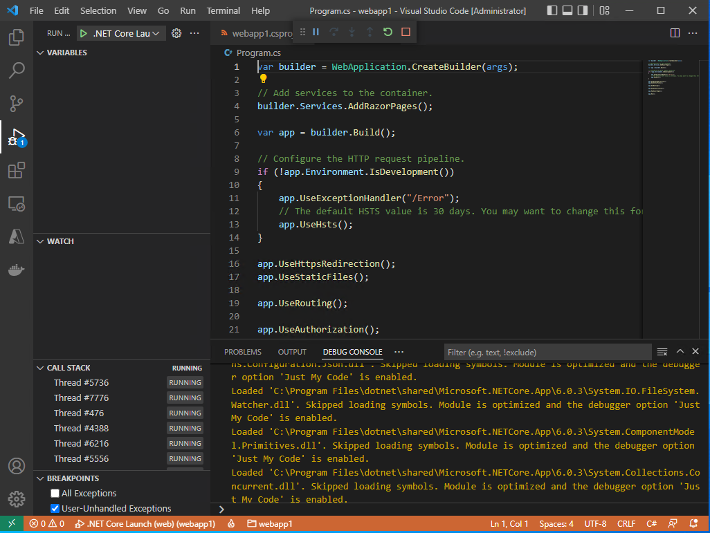
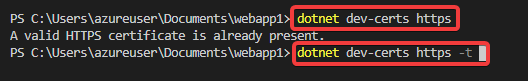
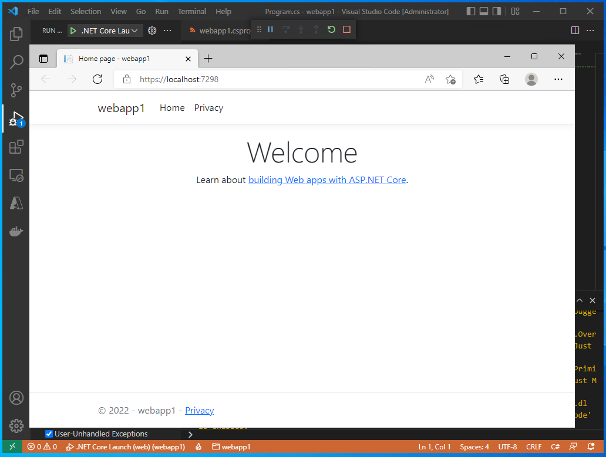
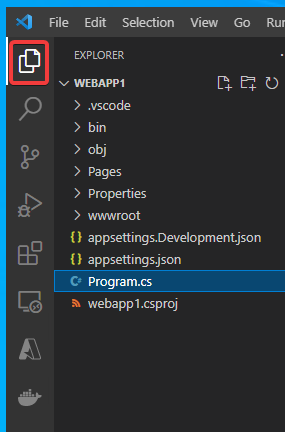

# Webアプリのデバッグ

画面左側のファイル一覧で、「Program.cs」を開く。

以下のようなダイアログ「Are you using a screen reader ... ?」が出た場合は「No」をクリック。

「F5」を押すか、「Run」メニューの「Start Debugging」を選択して、「デバッグ」を開始する。

Visual Studio Codeの画面は以下のようになる。

※デバッグ中はステータスバーがオレンジ色になる。

同時にWebブラウザ（Edge）が開くが、以下のような「Your connection isn't private」という表示となる。

いったんWebブラウザを閉じ、Visual Studio Code側では「□」をクリックして、「デバッグ」を終了する。

Terminalメニューから「New Terminal」を選択

`dotnet dev-certs https`と打ってエンター。

続いて`dotnet dev-certs https -t`と打ってエンター。

すると以下のような画面が出るので、Yesをクリック。

再度、F5を押して「デバッグ」を開始すると、以下のようなサンプルのWebアプリが表示される。

以上で、Webアプリの作成と実行ができた。

Webブラウザを閉じ、「デバッグ」を終了する。

画面左側の「Explorer」アイコン（一番上）をクリックすると、ファイル一覧の表示になる。

